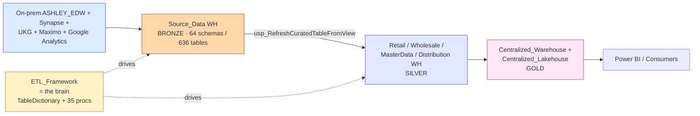

# 🚀 Onboarding — for new Data Engineers joining `EnterpriseData-Dev`

> **Read this first.** 6 things you must know before touching anything. ~10 minutes.

---

## 1. What is this workspace? (1 sentence)

**DEV mirror of Ashley Furniture's enterprise data platform.** Mostly a *definition store* (code + config) — **NOT a runner**. Real ETL execution happens in PROD workspace, Databricks, and legacy ADF (`ashleyv2datafactory`).

## 2. End-to-end flow



That's the whole story. Everything else is detail.

## 3. The ONLY thing running daily

**`Source_EDW_Check_Test`** pipeline — daily 03:50 UTC.
- Compares count + aggregate between on-prem EDW and Fabric
- Sends email diff via Office365 Logic App

**38 of 41 orchestration items have ZERO recent runs.** Don't assume anything is active without checking `jobs/instances`.

→ Detail: [`docs/04-orchestration/pipelines/source-edw-check-test.md`](docs/04-orchestration/pipelines/source-edw-check-test.md)

## 4. Control plane — read this and you understand the whole system

**`ETL_Framework.DW_Developer.TableDictionary`** (65 columns) = master catalog of every managed object.

Each row specifies:
- Source: server / database / table
- Target: Fabric WH / schema / table
- ETLTool: `Databricks` / `ADF` / `Fabric Pipeline`
- UpdateMethod + UpdateQuery (which proc loads it)

**Adding a new table to the platform:**
1. Add row to `TableDictionary` with source + target + UpdateQuery
2. The corresponding loader proc (e.g. `Usp_CreateTableFromParquet`) handles it on next run

→ Detail: [`docs/02-storage/warehouses/etl-framework.md`](docs/02-storage/warehouses/etl-framework.md)

## 5. Source of truth = Azure DevOps Git

Workspace is **`ConnectedAndInitialized`** to:
```
Organization:  ashleyfurniture
Project:       Enterprise Data Services
Repository:    Fabric-EnterpriseData
Branch:        main
```

→ **All changes flow through Git PRs.** Editing in Fabric UI without commit = desync.

## 6. ⚠️ Three things you must NEVER do as a new joiner

| Don't | Why |
|-------|-----|
| Run `MetaData-Pull` notebook **cell 1** | Plaintext SP secret in source. Use cell 2/3/4 (Key Vault). |
| Edit `Centralized_Lakehouse.Retail_*` schema tables | They are **OneLake shortcuts to PROD workspace**. Write back = touch PROD-shaped paths. |
| Trigger pipelines named `test` / `pipeline1` | Despite the name, they perform cross-workspace Copy from PROD into `Commissions_Prototype` SQLDatabase. NOT test. |

→ Full risk register: [`docs/09-risks/critical-and-high.md`](docs/09-risks/critical-and-high.md)

---

## 📚 Recommended reading order (first day)

| # | Time | File |
|---|---|---|
| 1 | 5 min | [`docs/01-introduction.md`](docs/01-introduction.md) — big picture + Git integration |
| 2 | 10 min | [`docs/02-storage/warehouses/etl-framework.md`](docs/02-storage/warehouses/etl-framework.md) — control plane brain |
| 3 | 5 min | [`docs/04-orchestration/pipelines/source-edw-check-test.md`](docs/04-orchestration/pipelines/source-edw-check-test.md) — the only running pipeline |
| 4 | 10 min | [`docs/03-logic/procs/README.md`](docs/03-logic/procs/README.md) — proc families overview, then drill into `refresh/` for `usp_RefreshCuratedTableFromView` |
| 5 | 10 min | [`docs/09-risks/critical-and-high.md`](docs/09-risks/critical-and-high.md) — 5 things NOT to break |

After these 5, you have ~80% of the workspace mental model. Drill-down detail pages exist for every warehouse, lakehouse, pipeline, proc family, and top-50 tables when you hit a specific task.

## 🛠️ Common tasks → where to start

| If you need to... | Start at |
|---|---|
| Understand a specific table's lineage | [`docs/05-data-flow/tables/`](docs/05-data-flow/tables/README.md) |
| See what a stored proc does | [`docs/03-logic/procs/`](docs/03-logic/procs/README.md) |
| Trace a pipeline activity-by-activity | [`docs/04-orchestration/pipelines/`](docs/04-orchestration/pipelines/README.md) |
| Find which workspaces feed this | [`docs/06-cross-workspace/`](docs/06-cross-workspace/README.md) |
| Check who has admin rights | [`docs/07-permissions/README.md`](docs/07-permissions/README.md) |
| Understand the alerting system | [`docs/08-operations/monitoring.md`](docs/08-operations/monitoring.md) |
| See visual overview | [`images/`](images/) — 9 SVG diagrams |

## 💡 Mental model

Think of `EnterpriseData-Dev` as **3 layers**:

1. **Brain** (`ETL_Framework`) — the orchestration metadata + 35 procs that drive everything
2. **Body** (`Source_Data` → domain WHs → `Centralized_*`) — the 4-tier data progression (bronze → silver → gold)
3. **Senses** (pipelines + notebooks + mirror + ADF mount) — the ingestion + monitoring channels

When something breaks, ask:
- Is the brain confused? (TableDictionary entry wrong?)
- Is the body bloated/empty? (`Quality_Warehouse` is empty for a reason — yet to be built)
- Are the senses connected? (most pipelines dormant — execution may be elsewhere)

---

_Generated 2026-05-10 from comprehensive scan. Update by re-running `python3 scripts/_build_docs.py` after a fresh scan._
