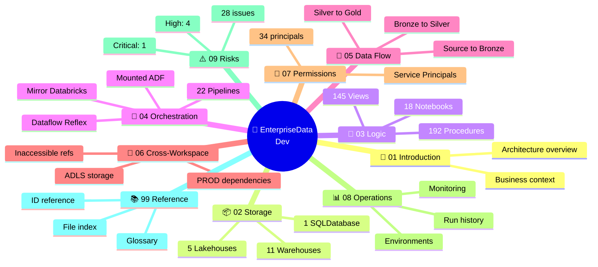

# 🧠 EnterpriseData-Dev — Documentation Repository

> **Living documentation** for Microsoft Fabric workspace `EnterpriseData-Dev` (Ashley Furniture). Generated from a comprehensive scan capturing all 71 items, 192 stored procedures, 145 views, 412 shortcuts, 412 GUIDs cross-referenced, and full code bodies.

## 🚀 New here? Start with [ONBOARDING.md](ONBOARDING.md) — 10-minute orientation.

## 📌 Workspace identity

| Field | Value |
|---|---|
| Workspace name | `EnterpriseData-Dev` |
| Workspace ID | `5360a935-1984-4775-895f-f4c90bafa19d` |
| Tenant | Ashley Furniture (`@Ashleyfurniture.com`) |
| Capacity | `30d06c17-...` East US, Dedicated, Large dataset |
| Workspace SPN | `14bfa211-3cab-...` |
| Total items scanned | **71** |
| Scan date | 2026-05-08 |
| Doc generated | 2026-05-10 |

## 📊 At a glance

       

## 🗺️ Repository map



## 📚 Documentation index

| § | Topic | Description |
|---|---|---|
| 01 | [📘 Introduction](docs/01-introduction.md) | What is this workspace, business context, key concepts |
| 02 | [📦 Storage Layer](docs/02-storage/README.md) | 11 WH + 5 LH + 1 SQLDB — where data lives |
| 03 | [🧠 Logic Layer](docs/03-logic/README.md) | 192 procs + 145 views + 18 notebooks — what computes |
| 04 | [🔁 Orchestration](docs/04-orchestration/README.md) | 22 pipelines + mirror + ADF — what schedules |
| 05 | [🔀 Data Flow](docs/05-data-flow/README.md) | End-to-end lineage source → sink |
| 06 | [🔗 Cross-Workspace](docs/06-cross-workspace/README.md) | External dependencies |
| 07 | [🔐 Permissions](docs/07-permissions/README.md) | 34 principals, role matrix, SPN risks |
| 08 | [📊 Operations](docs/08-operations/README.md) | Run history + monitoring + envs |
| 09 | [⚠️ Risks](docs/09-risks/README.md) | 28-risk register |
| 99 | [📚 Reference](docs/99-reference/README.md) | Glossary, IDs, methodology |

## 🚦 Reading recipes

### Recipe 1 — New contributor onboarding (30 min)
1. [📘 Introduction](docs/01-introduction.md) — 5 min
2. [📦 Storage overview](docs/02-storage/README.md) — 5 min
3. [🔀 Data Flow](docs/05-data-flow/README.md) — 10 min
4. [⚠️ Top 5 risks](docs/09-risks/README.md) — 10 min

### Recipe 2 — Debug a specific table/proc/pipeline
1. [99 ID Reference](docs/99-reference/id-reference.md) — find the item
2. Click drill-down link → its dedicated page
3. Raw JSON or code in [`data/`](data/) folder if needed

### Recipe 3 — Audit security & risks
1. [🔐 Permissions](docs/07-permissions/README.md)
2. [⚠️ Risks — Critical & High](docs/09-risks/critical-and-high.md)
3. [🔗 Cross-WS deps](docs/06-cross-workspace/README.md)

## 🏗️ Repo structure

```
EnterpriseData-Dev-Docs/
├── README.md                           ← you are here
├── docs/
│   ├── 01-introduction.md
│   ├── 02-storage/
│   │   ├── README.md                  ← storage overview
│   │   ├── warehouses/
│   │   │   ├── README.md             ← 11 WH compared
│   │   │   ├── etl-framework.md      ← control plane deep dive
│   │   │   ├── source-data.md
│   │   │   ├── retail-warehouse.md
│   │   │   ├── wholesale-warehouse.md
│   │   │   ├── centralized-warehouse.md
│   │   │   ├── masterdata-warehouse.md
│   │   │   ├── distribution-warehouse.md
│   │   │   └── quality-warehouse.md
│   │   └── lakehouses/
│   │       ├── README.md
│   │       ├── centralized-lakehouse.md
│   │       ├── a-developement.md
│   │       └── radarsync-test.md
│   ├── 03-logic/
│   ├── 04-orchestration/
│   ├── 05-data-flow/
│   ├── 06-cross-workspace/
│   ├── 07-permissions/
│   ├── 08-operations/
│   ├── 09-risks/
│   └── 99-reference/
├── images/                             ← rendered Mermaid SVG/PNG
├── data/                               ← raw scan JSON (preserved)
├── scripts/                            ← scan + build scripts
└── _archive/                           ← old artifacts (preserved)
```

## 🔧 Regenerate

## 🔬 NEW: Detail layer (v2 — added 2026-05-10)

The repo now ships **per-item deep-dive pages** beyond the high-level overview:

| Detail layer | Pages | Description |
|---|---:|---|
| [📜 Per-pipeline walkthroughs](docs/04-orchestration/pipelines/README.md) | 22 | Activity tree + source/sink mapping + parameters + run history per pipeline |
| [⚙️ Per-proc narrative](docs/03-logic/procs/README.md) | 60 | Inputs/outputs detected, narrative explanation, code excerpt for top procs |
| [🔍 Per-table lineage](docs/05-data-flow/tables/README.md) | 50 | Top tables with writers/readers + Mermaid lineage subgraph |
| [🕸️ Dependency graphs](docs/05-data-flow/dependency-graphs.md) | 1 | Proc call graph + pipeline→proc edges |
| [🔌 Connections](docs/06-cross-workspace/connections.md) | 1 | 12 data sources (SharePoint, SQL, Lakehouse) |
| [⚙️ Workspace settings](docs/08-operations/workspace-settings.md) | 1 | Spark settings + capacity + folders |

> **Navigate top-down:** start with [01-introduction.md](docs/01-introduction.md), drill via category READMEs, end at detail pages above.


```bash
# Re-scan the workspace (~30 minutes)
python3 scripts/_scan_lakehouses.py
python3 scripts/_scan_procs_views.py
python3 scripts/_scan_shortcuts_files.py
python3 scripts/_scan_pipeline_runs.py

# Re-build all docs
python3 scripts/_build_docs.py
```

---

_Scan date: 2026-05-08 · Doc generated: 2026-05-10_
