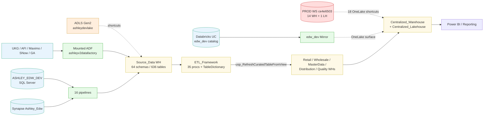

# 📘 01 — Introduction

[← Back to root](../README.md)

## What is `EnterpriseData-Dev`?

A **Microsoft Fabric workspace** in Ashley Furniture's tenant that serves as the **DEV environment** of the company's enterprise data platform. It mirrors the structure of the legacy SQL Server EDW (`ASHLEY_EDW_DEV` + Synapse `Ashley_Edw`) onto Fabric Warehouses + Lakehouses, while keeping a parallel Databricks Unity Catalog (`edw_dev`) live-mirrored.

## 🏢 Business context

Ashley Furniture is in the **middle of a multi-year EDW → Fabric migration**. Evidence visible in this workspace:

- **Mounted Azure Data Factory** `ashleyv2datafactory` (RG `IoT_Hub`) — the legacy ADF still alive and referenced.
- Pipeline `Fabric Migration ADF` ports table definitions from Synapse `Ashley_Edw.dw_developer.tabledictionary` into Fabric.
- Pipeline `EDW2FabricLoader` reads metadata config `ASHLEY_EDW_DEV.dw_developer.FabricMapping` (Flag=1) → row-by-row Copy into Fabric `Source_Data`.
- **Mirrored Databricks Catalog** `edw_dev` syncing in Full / autoSync mode (last sync 2026-05-08 05:57 Success).
- **`ETL_Framework` warehouse** with 35 stored procedures + 65-column `TableDictionary` = the workspace's metadata-driven orchestration brain.

## 🏗️ High-level architecture

> Open the SVG in a browser for full zoom. Source Mermaid below.

## 🧩 Key concepts

Fabric introduces several object types you'll encounter throughout this doc:

| Object | What it is |
|---|---|
| **Workspace** | Logical container grouping items under one capacity |
| **Warehouse** | T-SQL relational engine on top of OneLake parquet (read/write) |
| **Lakehouse** | Delta Lake tables + Files folder on OneLake (with auto SQL endpoint) |
| **Schema-enabled Lakehouse** | Newer LH variant supporting `[schema].[table]` namespace (vs legacy `dbo` only) |
| **OneLake** | Unified ADLS Gen2 storage backing all Fabric items |
| **Shortcut** | Symbolic link — point a path in this LH/WH to data elsewhere (cross-WS or external) |
| **Mirror (Databricks)** | Live read-only mirror of a Databricks UC into Fabric OneLake |
| **Mounted ADF** | Reference link to existing Azure Data Factory — surfaces inside Fabric |
| **Dataflow Gen2** | Power Query M-based no-code data prep with auto-staging |
| **Reflex (Activator)** | Event-driven trigger watching data and firing actions |
| **Spark Environment** | Reusable compute config (runtime, pool, libraries) for notebooks |

Full glossary including **Ashley Furniture domain terms** (UKG, AFI, Maximo, ADS, etc.) → [99 Reference / Glossary](99-reference/glossary.md)

## 🔥 5 things you must know before contributing

1. **🚨 The data isn't really here.** Centralized_Lakehouse 5.92 B rows are 18 OneLake shortcuts to PROD workspace `EnterpriseData` (`ce4e6503-...`). Don't write back unless you mean to affect PROD-shaped paths.
2. **🛌 Most things are dormant.** Only **3 of 41** orchestration items have any recent run history. The workspace is mostly a **definition store**.
3. **⚠️ ETL_Framework is the brain.** Any change to `TableDictionary` or its 35 procs ripples through all domain warehouses.
4. **🔴 Critical security risk:** `MetaData-Pull` notebook cell 1 has a plaintext SP secret. Rotate immediately.
5. **🔁 Naming is treacherous.** Pipelines named `test`, `pipeline1` are real cross-WS PROD copies into `Commissions_Prototype`. Rename before touching.

---

**Next:** [📦 02 — Storage Layer](02-storage/README.md)

## 🔄 Git integration (Azure DevOps)

The workspace is **`ConnectedAndInitialized`** to Azure DevOps:

| Field | Value |
|---|---|
| Provider | `AzureDevOps` |
| Organization | `ashleyfurniture` |
| Project | `Enterprise Data Services` |
| Repository | `Fabric-EnterpriseData` |
| Branch | `main` |
| Directory | `/` |
| Sync state | `ConnectedAndInitialized` |

→ **The Azure DevOps repo is the source of truth.** Changes to items in this workspace should flow through Git PRs in `ashleyfurniture/Enterprise Data Services/Fabric-EnterpriseData`. Direct UI edits without git commit will desync.
