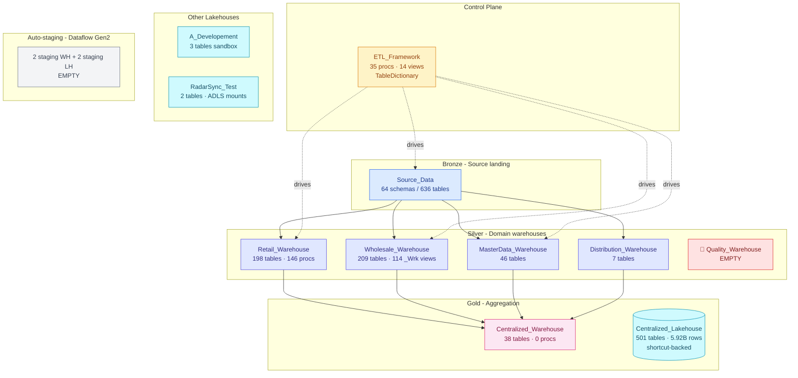

# 📦 02 — Storage Layer

[← Back to root](../../README.md)

## What lives here

Storage = where data physically resides (or *appears* to reside via shortcuts). Three storage primitives in this workspace:

| Type | Count | Total tables | Total rows | Detail |
|---|---|---|---|---|
| 🏬 **Warehouse** | 11 | 1,165 | — | [See Warehouses →](warehouses/README.md) |
| 💧 **Lakehouse** | 5 | 506 | 5,923,323,398 | [See Lakehouses →](lakehouses/README.md) |
| 🗄️ **SQLDatabase** | 1 | — | — | Commissions_Prototype (sink) |

> Most of those 5.92 B rows are **OneLake shortcuts to the PROD workspace**, not stored locally. See [05 Data Flow](../05-data-flow/README.md) and [06 Cross-Workspace](../06-cross-workspace/README.md).

## 🗺️ Storage map

## 📑 Sub-pages

- [🏬 **Warehouses (11)** ](warehouses/README.md) — relational T-SQL containers
- [💧 **Lakehouses (5)**](lakehouses/README.md) — Delta Lake on OneLake

## ⚠️ Storage-related risks

- **C3 (High)**: `Quality_Warehouse` (PROD tier) is empty — needs build or remove decision
- **C25 (High)**: 5.92 B rows in `Centralized_Lakehouse` are shortcut-backed, not real DEV data
- **C28 (High)**: `RadarSync_Test` mounts entire trusted+raw ADLS zones — broad scope
- **C20 (Low)**: Twin schemas `Retail_Corporate` ↔ `Retail_Corporate_Prod` confusion

Full risk list → [09 Risks](../09-risks/README.md)

---

**Next:** [🏬 Warehouses →](warehouses/README.md) or [💧 Lakehouses →](lakehouses/README.md)
