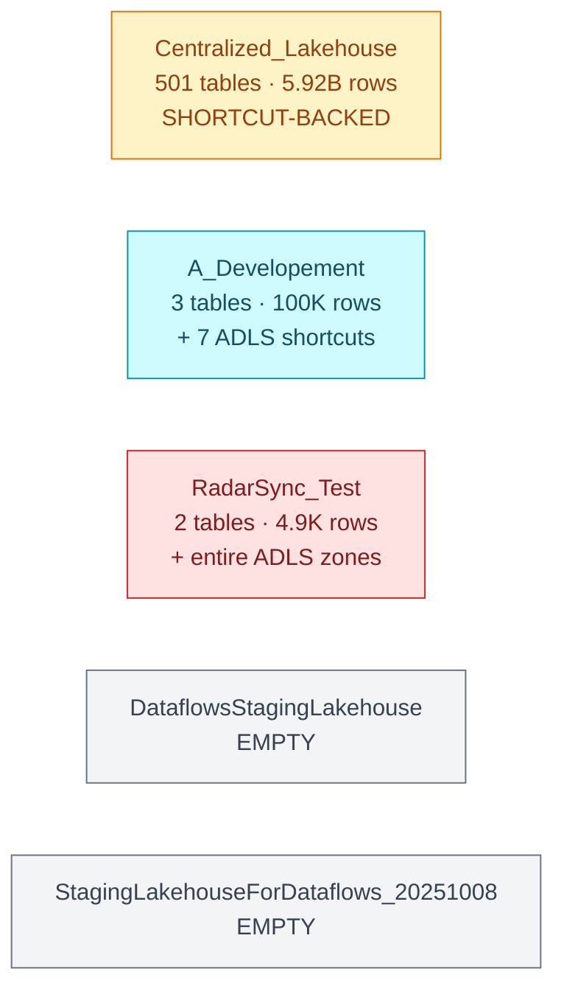

# 💧 Lakehouses (5)

[← Storage](../README.md) · [← Root](../../../README.md)

## Comparison table

| Lakehouse | Tier | Tables | Rows | Schemas-enabled? | Detail |
|---|---|---|---|---|---|
| [`Centralized_Lakehouse`](centralized-lakehouse.md) | PROD | 501 | 5,923,323,398 | ✅ | [→](centralized-lakehouse.md) |
| [`A_Developement`](a-developement.md) | DEV-SANDBOX | 3 | 100,514 | — | [→](a-developement.md) |
| [`RadarSync_Test`](radarsync-test.md) | TEST | 2 | 4,904 | ✅ | [→](radarsync-test.md) |
| `DataflowsStagingLakehouse` | AUTO | 0 | 0 | — | (empty staging) |
| `StagingLakehouseForDataflows_20251008191803` | AUTO | 0 | 0 | — | (empty staging) |

**Total:** 506 tables · 5,923,323,398 rows

## 🌐 Lakehouse purposes at a glance

### [Centralized_Lakehouse](centralized-lakehouse.md) · _PROD_

**Shortcut-aggregation layer** — 501 tables / 5.92 B rows nhưng 18 shortcuts trỏ thẳng vào PROD WS Source_Data + Retail_Warehouse. Data thật KHÔNG ở DEV.

_21 schemas. Twin schemas Retail_Corporate ↔ Retail_Corporate_Prod = 2 shortcuts cùng PROD path._

### [A_Developement](a-developement.md) · _DEV-SANDBOX_

**Personal dev sandbox** — 3 local tables (afi_finance, drive4ashley, testing1) + 7 ADLS shortcuts trỏ external storage `ashleydevlake`.

_Schemas-disabled (legacy). Smallest active LH._

### [RadarSync_Test](radarsync-test.md) · _TEST_

**Sandbox lakehouse** — 2 local tables (joblabor 4900 rows, test_pipeline 4 rows) + ⚠️ mounts ENTIRE trusted-zone + raw-zone ADLS containers.

_🔴 Broad ADLS scope — anyone with this LH access reads entire dev data lake._

---

**Next:** any lakehouse above
