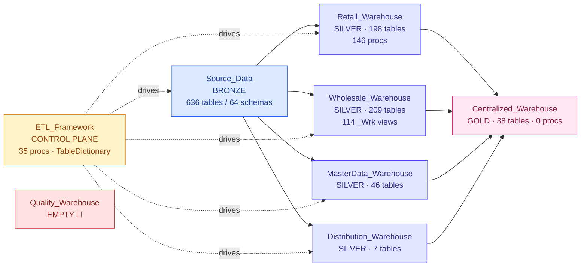

# 🏬 Warehouses (11)

[← Storage](../README.md) · [← Root](../../../README.md)

## Comparison table

| Warehouse | Tier | Schemas | Tables | Views | Procs | Detail |
|---|---|---|---|---|---|---|
| [`ETL_Framework`](etl-framework.md) | PROD-CTRL | 13 | 31 | 14 | 35 | [→](etl-framework.md) |
| [`Source_Data`](source-data.md) | PROD-SRC | 64 | 636 | 12 | 2 | [→](source-data.md) |
| [`Centralized_Warehouse`](centralized-warehouse.md) | PROD | 23 | 38 | 12 | 0 | [→](centralized-warehouse.md) |
| [`Retail_Warehouse`](retail-warehouse.md) | PROD | 25 | 198 | 41 | 146 | [→](retail-warehouse.md) |
| [`Wholesale_Warehouse`](wholesale-warehouse.md) | PROD | 28 | 209 | 126 | 8 | [→](wholesale-warehouse.md) |
| [`MasterData_Warehouse`](masterdata-warehouse.md) | PROD | 14 | 46 | 12 | 0 | [→](masterdata-warehouse.md) |
| [`Distribution_Warehouse`](distribution-warehouse.md) | PROD | 8 | 7 | 12 | 0 | [→](distribution-warehouse.md) |
| [`Quality_Warehouse`](quality-warehouse.md) | PROD-EMPTY | 6 | 0 | 12 | 0 | [→](quality-warehouse.md) |
| `StagingWarehouseForDataflows_20251008191817` | AUTO | 6 | 0 | 12 | 0 | (auto/test) |
| `DataflowsStagingWarehouse` | AUTO | 6 | 0 | 12 | 0 | (auto/test) |
| `Test_Owneraccess` | TEST | 6 | 0 | 12 | 0 | (auto/test) |

**Total:** 199 schemas · 1,165 tables · 277 views · 191 procedures

## 🎯 Warehouse roles in the architecture

## 📚 Per-warehouse detail

### [ETL_Framework](etl-framework.md) · _PROD-CTRL_

**Control plane warehouse** — chứa `TableDictionary` (65-cột master catalog) + 35 stored procs điều phối parquet→Delta loading + audit + SLA logging cho toàn bộ workspace.

_Hub of the whole workspace. Every loader proc lives here. AuditLog + EmailQueue tables are here._

### [Source_Data](source-data.md) · _PROD-SRC_

**Bronze landing layer** — 64 schemas (1 schema per source feed). Loaded by EDW2FabricLoader pipeline + ADF mount + migration pipelines. Largest WH by table count.

_Receives every raw feed. Schemas mirror source-system names: Retail_Corporate, MasterData_HR_UKG_*, Manufacturing_Maximo, etc._

### [Centralized_Warehouse](centralized-warehouse.md) · _PROD_

**Gold tier warehouse** — 38 tables / **0 procs nội bộ**. Loaded externally bởi `MetaData-Pull` notebook (cross-WH JDBC sync) chứ không có proc bên trong.

_MetaData schema chứa control tables (CopyTables, ShortcutCatalog, SysObjectInfo) drive cho notebooks & system pipelines._

### [Retail_Warehouse](retail-warehouse.md) · _PROD_

**Silver tier domain warehouse cho retail** — 198 tables, 41 views, 146 stored procs. Largest proc set trong workspace.

_Heaviest proc family: 49 Refresh-Load + 38 MERGE + 19 Validate + 13 Audit-DQ. Pattern: usp_RefreshCuratedTableFromView consume _Wrk views._

### [Wholesale_Warehouse](wholesale-warehouse.md) · _PROD_

**Silver tier domain warehouse cho wholesale** — 209 tables, 126 _Wrk views, 8 procs (avg 20K chars/proc, MERGE-heavy).

_Most _Wrk views: Marketing_Wrk (35), CustomerOrders_AFI_Wrk (24), Pricing_AFI_Wrk (20), SalesHistory_AFI_Wrk (12), PartyContacts_Wrk (9)._

### [MasterData_Warehouse](masterdata-warehouse.md) · _PROD_

**Silver tier master data warehouse** — 46 tables / 0 procs nội bộ. Loaded by ETL_Framework procs (cross-WH).

_Master data domain — items, customers, vendors, products. Logic centralized in ETL_Framework._

### [Distribution_Warehouse](distribution-warehouse.md) · _PROD_

**Silver tier distribution domain — chỉ 7 tables**, có thể là shadow domain chưa build đầy đủ. [Likely].

_Only 7 tables — incomplete or future domain._

### [Quality_Warehouse](quality-warehouse.md) · _PROD-EMPTY_

**EMPTY** — Tier=PROD nhưng 0 tables / 0 procs. Có thể là DQ domain chưa build hoặc đã bị bỏ. [Speculation on intent]

_🔴 PROD tier empty shell — needs decision: build or remove._

**Test/staging WHs (no detail page):**
- `StagingWarehouseForDataflows_20251008191817` — _AUTO_. Auto-provisioned Dataflow Gen2 staging WH. Empty.
- `DataflowsStagingWarehouse` — _AUTO_. Auto-provisioned Dataflow Gen2 staging WH. Empty.
- `Test_Owneraccess` — _TEST_. Leftover từ permissions-testing exercise — empty TEST WH.

---

**Next:** any warehouse above, or [💧 Lakehouses →](../lakehouses/README.md)
