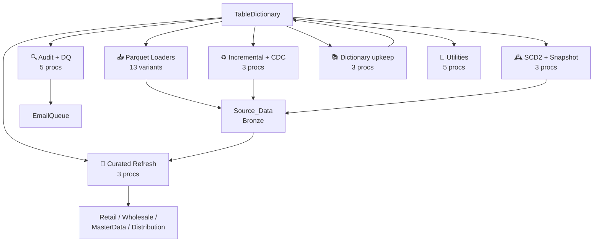

# 🏬 ETL_Framework

_PROD-CTRL tier · ID `02c8970b-7af3-4d4e-b011-cc3cdc3825ef`_

[← Warehouses](README.md) · [← Storage](../README.md) · [← Root](../../../README.md)

## 🎯 Purpose

**Control plane warehouse** — chứa `TableDictionary` (65-cột master catalog) + 35 stored procs điều phối parquet→Delta loading + audit + SLA logging cho toàn bộ workspace.

## 📊 Stats

| Metric | Value |
|---|---|
| Tier | PROD-CTRL |
| Schemas | 13 |
| Tables | 31 |
| Views | 14 |
| Stored Procedures | 35 |
| Workspace ID | `5360a935-1984-4775-895f-f4c90bafa19d` |
| Item ID | `02c8970b-7af3-4d4e-b011-cc3cdc3825ef` |

**Highlight:** Hub of the whole workspace. Every loader proc lives here. AuditLog + EmailQueue tables are here.

## 🗂️ Schemas

`DW_Developer`, `INFORMATION_SCHEMA`, `Manufacturing_Maximo`, `MasterData_ItemMaster_AFI`, `Performance_Logs`, `Retail_DW`, `Wholesale_ProductSourcing_AFI`, `Wholesale_Quality_AFI_wrk`, `_rsc`, `dbo`, `guest`, `queryinsights`, `sys`

## 📋 Tables (31)

**Top 30 tables (sample):**

| Schema | Table | Rows | Modified |
|---|---|---|---|
| `dbo` | `InsertColumns` | 0 | 2025-09-01 |
| `DW_Developer` | `AuditLog` | 0 | 2025-08-15 |
| `DW_Developer` | `EnvironmentControl` | 0 | 2025-09-01 |
| `DW_Developer` | `FabricLoad` | 0 | 2025-09-01 |
| `DW_Developer` | `Source_EDW_AggCheck` | 0 | 2026-04-17 |
| `DW_Developer` | `Source_EDW_CountCheck` | 0 | 2026-04-02 |
| `DW_Developer` | `TableDictionary` | 0 | 2026-02-13 |
| `DW_Developer` | `TableDictionary_clone` | 0 | 2026-02-13 |
| `DW_Developer` | `TableDictionary_edw_1` | 0 | 2025-08-18 |
| `DW_Developer` | `TableDictionary_Security` | 0 | 2025-08-15 |
| `DW_Developer` | `TableDictionary_Test` | 0 | 2025-09-02 |
| `DW_Developer` | `TableDictionary_UpdateLog` | 0 | 2025-08-15 |
| `DW_Developer` | `TableDictionary_UpdateLog_RadarSync` | 0 | 2025-08-15 |
| `Manufacturing_Maximo` | `Fedex` | 0 | 2025-08-26 |
| `Manufacturing_Maximo` | `Joblabor_bckup` | 0 | 2025-08-20 |
| `Manufacturing_Maximo` | `WMSOLSTS` | 0 | 2025-08-29 |
| `MasterData_ItemMaster_AFI` | `ITEMASA` | 0 | 2025-11-27 |
| `Performance_Logs` | `DimEmailQueue` | 0 | 2026-04-20 |
| `Performance_Logs` | `EmailQueue` | 0 | 2025-09-12 |
| `Performance_Logs` | `tblFabricDataFeedAlertLog` | 0 | 2025-09-12 |
| `Performance_Logs` | `tblFabricDataFeedAlertLogDetail` | 0 | 2025-09-12 |
| `Performance_Logs` | `tblFabricSLAAlertLog` | 0 | 2026-02-13 |
| `Performance_Logs` | `tblFabricSLAAlertLogDetail` | 0 | 2026-02-13 |
| `Performance_Logs` | `tblSLAAlertSuppressionTracker` | 0 | 2026-02-13 |
| `Retail_DW` | `AshleyServiceNowIncident` | 0 | 2025-09-02 |
| `Retail_DW` | `AshleyServiceNowRequest` | 0 | 2025-09-02 |
| `Retail_DW` | `AshleyServiceNowUser` | 0 | 2025-09-18 |
| `Retail_DW` | `BtaData` | 0 | 2025-09-11 |
| `Retail_DW` | `FlatBOM` | 0 | 2025-09-03 |
| `Retail_DW` | `kit` | 0 | 2025-08-28 |

_… and 1 more. Full list in [`data/03-warehouses-raw.json`](../../../data/03-warehouses-raw.json)._

## 👁️ User views (2)

| Schema | Views | Names (sample) |
|---|---|---|
| `DW_Developer` | 2 | `FlatBomFabric`, `SchemaMappings` |

Full view bodies → [`data/07-views-raw.json`](../../../data/07-views-raw.json)

## ⚙️ Stored procedures (35)

| Family | Procs | Examples |
|---|---|---|
| Parquet loaders | 12 | `Usp_CreateTableFromParquet`, `Usp_CreateTableFromParquet_1`, `Usp_CreateTableFromParquet_Simple_NoCurs`, …+9 |
| Curated refresh | 6 | `usp_RefreshCuratedTableFromView`, `usp_RefreshCuratedTableFromView2`, `usp_UpdateCuratedTableFromView_DateRange`, …+3 |
| Alert/SLA | 5 | `usp_DataWarehouseDataFeedAlert_Fabric`, `usp_DataWarehouseSLAAlert_Fabric`, `usp_GenerateEmailHTML_DimAggregateDiffer`, …+2 |
| Audit/DQ | 3 | `usp_Audit_ADW_Tables`, `usp_Audit_ADW_Tables_V1`, `usp_Audit_Fabric_Tables` |
| Incremental | 3 | `usp_IncrementalTableLoad`, `usp_IncrementalTableLoad_Backup`, `usp_IncrementalTableLoad_CDC` |
| Drop/Cleanup | 2 | `usp_DropConstraints`, `usp_DropWorkTable` |
| Other | 2 | `usp_GrantSchemaSecurity`, `Usp_WriteTableToParquet` |
| SCD2/Snapshot | 2 | `usp_SCD2_TableLoad`, `Usp_SnapshotLoad` |

Full proc bodies → [`data/06-procs-raw.json`](../../../data/06-procs-raw.json)

## 🧠 The brain — `TableDictionary` (65 columns)

This single table is the **metadata-driven orchestration heart** of the workspace. One row per managed object.

**Key columns observed in sample data:**

- `ServerName` / `DatabaseName` / `SchemaName` / `TableName` — the target (Fabric or EDW)
- `ObjectType` — TABLE / VIEW / etc.
- `PrimaryKey` / `AlternateKey`
- `StorageType` — `Delta` / `HEAP` / etc.
- `DistributionKey` / `IndexType` — `CLUSTERED` etc.
- `SourceSystem` / `SourceServer` / `SourceDatabase` / `SourceObject` — where the data comes from
- `ETLTool` — `Databricks` / `ADF` / etc.
- `PackageName` / `RefreshRate` / `UpdateMethod`
- `ExtractQuery` / `UpdateQuery` — the actual SQL/proc invocation

**Example sample row:**
```
EDW-Fabric / Source_Data / MasterData_HR_UKG_DSG_Wrk / TAPayCodeMap
StorageType=Delta, IndexType=CLUSTERED, ETLTool=Databricks,
UpdateQuery=[DW_Developer].[Usp_CreateTableFromParquet]
```

→ confirms the metadata-driven, parquet-based ingestion via Databricks → Fabric Delta tables.

## 🔄 Procedure family tree



## 📋 Other key tables

| Table | Purpose |
|---|---|
| `DW_Developer.AuditLog` | Runtime audit log (Description, DateTime, User, Command). Real errors visible: `usp_RefreshCuratedTableFromView: Retail_Warehouse.MasterData_Retail.SalesPerson` with `String or binary data would be truncated.` |
| `DW_Developer.EnvironmentControl` | Env routing — sample: `GBL / AzureDataFabric / DEV / Source_Data` confirms this is the DEV env |
| `DW_Developer.FabricLoad` | Fabric-specific load metadata |
| `DW_Developer.Source_EDW_AggCheck` | Aggregate reconciliation EDW vs Fabric |
| `DW_Developer.Source_EDW_CountCheck` | Row-count reconciliation |
| `Performance_Logs.tblFabricDataFeedAlertLog` | Data-feed alert log (+ _Detail sibling) |
| `Performance_Logs.tblFabricSLAAlertLog` | SLA alert log (+ _Detail sibling) |
| `Performance_Logs.EmailQueue` | Outbound email queue |
| `Performance_Logs.DimEmailQueue` | Dimension table for email queue |

## ⚠️ Risks specific to ETL_Framework

- **C9 (Low)**: Stranded business tables in ETL_Framework (`Manufacturing_Maximo.Fedex`, `MasterData_ItemMaster_AFI.ITEMASA`, `Retail_DW.AshleyServiceNow*`, `BtaData`, `FlatBOM`, `kit`, `StoreMasterCustom`) — should live in domain WHs
- **C10 (Low)**: 4 clones of `TableDictionary` (`_clone`, `_edw_1`, `_Test`, `_Security`) + 2 `_UpdateLog*` siblings → drift / authority ambiguity
- **C19 (Low)**: 13 parquet-loader proc variants — needs consolidation

---

**Related:** [03 Logic — Stored Procedures](../../03-logic/stored-procs.md) · [04 Orchestration — Pipelines](../../04-orchestration/pipelines.md)
