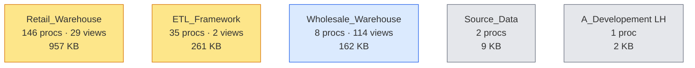

# 🧠 03 — Logic Layer

[← Root](../../README.md)

## What lives here

Code & transformations that compute over the [Storage Layer](../02-storage/README.md).

| Type | Count | Total size | Detail |
|---|---|---|---|
| ⚙️ **Stored Procedures** | 192 | 1.39 MB code | [See procs →](stored-procs.md) |
| 👁️ **User Views** | 145 | — | [See views →](views.md) |
| 📓 **Notebooks** | 18 | — | [See notebooks →](notebooks.md) |

## 🌳 Logic distribution by warehouse

## 📑 Sub-pages

- [⚙️ Stored Procedures](stored-procs.md) — 192 procs grouped by family
- [👁️ Views](views.md) — 145 user views (mostly `_Wrk` working sets)
- [📓 Notebooks](notebooks.md) — 18 notebooks grouped: 6 active prod, 3 Vers5 dup, 6 ad-hoc, 3 empty

---
