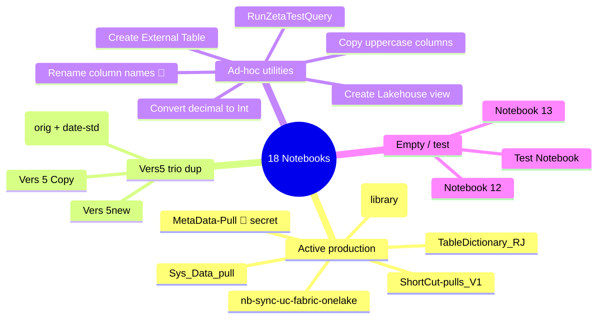
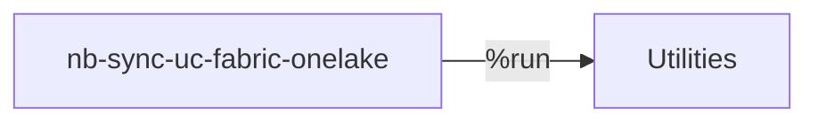

# 📓 Notebooks (18)

[← Logic](README.md) · [← Root](../../README.md)

## Groups

## 🔥 Active production (6)

| Notebook | Tag | Purpose |
|---|---|---|
| `MetaData-Pull` | 🔴 Plaintext SP secret cell 1 | Cross-WH JDBC sync — đọc Centralized_Warehouse.MetaData.CopyTables rồi copy mọi WH → Centralized_Warehouse.{src}_{schema}.{table} |
| `ShortCut-pulls_V1` | Cross-WS scan | Inventories all shortcuts on Lakehouses+Warehouses via Fabric REST → writes Centralized_Warehouse.MetaData.ShortcutCatalog. WS filter trỏ 13eefa5e (ngoài DEV) |
| `Sys_Data_pull` | — | Variant của MetaData-Pull, restricted to Source_Data WH. Cell 4 mature impl với TokenManager + retry/backoff |
| `TableDictionary_RJ` | — | Reads Enterprise_Lakehouse.dw_developer.tabledictionary → parquet → Enterprise_Lakehouse.{schema}.{table} |
| `Utilities` | Library | Library notebook — Databricks-UC ↔ Fabric-shortcut helpers. Called via `%run` |
| `nb-sync-uc-fabric-onelake` | Cross-WS target | %run Utilities → sync edw_dev.retail_marketing UC → Marketing_Lakehouse trong workspace sg_DHalama |

## 🟠 Vers 5 trio (3 near-duplicates)

| Variant | Cells | Default LH | Distinguishing |
|---|---|---|---|
| Vers 5 (orig) | 1 | Wholesale_Lakehouse | Filter `%HGD%`. **Has date-standardize step**. Stale lakehouse GUID `75f83a27-...` |
| Vers 5 Copy | 2 | Wholesale_Lakehouse | Filter `OneSource%` + `PartyContacts%`. **No date-standardize**. Workspace-name path |
| Vers 5new | 2 | Enterprise_Lakehouse | Cell 1 same as Copy cell 2 minus `NOT LIKE %Msa%`. Cell 2 byte-identical to Copy cell 2 |

**Recommendation:** collapse into 1 parameterized notebook. Parameters: `filter_clause`, `target_lakehouse`, `enable_date_standardize`. Merge in Vers 5's date-standardize step.

## 🟡 Ad-hoc utilities (6)

| Notebook | Purpose |
|---|---|
| `Convert a column in a delta from decimal to Int` | Cast `GMCFISCALMONTH` decimal→int trên `CostAccounting_Lakehouse/Tables/FIF115` |
| `Copy Data from source to target (deltas) convert column names to upper case` | Copies `GrossMarginCubeData` → `FIF115` uppercasing column names |
| `Create External Table from parquet in Lakehouse` | Reads `FIF115.snappy.parquet` → external Delta `CostAccounting_Lakehouse.FIF115_Load` |
| `Create a Lakehouse view` | Demo SQL — creates view `caassd` rồi DROP |
| `Rename column names in a delta table` | Renames ~60 columns trên `Finance_Lakehouse.Wholesale_Invoicing_AFI/TSITXN`. 🐞 `delta_table_path2` undefined → NameError |
| `RunZetaTestQuery` | 3 exploration queries trên `DHalama_Lakehouse` + `Retail_Lakehouse`. No writes |

## 💀 Empty / test (3)

- `Test Notebook` — ADF pipeline-run scratchpad (29 LOC)
- `Notebook 12` — Empty SQL stub (2 lines comment)
- `Notebook 13` — Placeholder của MS Fabric UC↔OneLake sample. ⚠️ Loads `util.py` từ public GitHub raw URL (supply-chain risk)

## 🔗 Notebook dependency graph

Only **one** internal edge in the entire workspace:

No `mssparkutils.notebook.run` calls anywhere.

## 📂 Drill-down

- Per-notebook source code: [`data/notebooks/`](../../data/notebooks/) (18 .ipynb + 18 .py)
- Structured analysis: [`data/04-notebooks-raw.json`](../../data/04-notebooks-raw.json)

---
