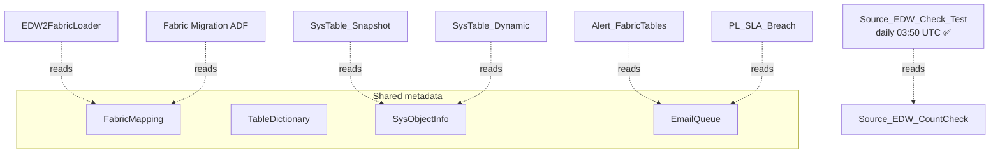

# 🔁 04 — Orchestration

[← Root](../../README.md)

## What lives here

Triggers, schedulers, and integrations — what schedules **when** logic runs.

| Type | Count | Detail |
|---|---|---|
| 🔁 **Data Pipelines** | 22 | [See pipelines →](pipelines.md) |
| 🪞 **Mirror (Databricks)** | 1 | [See mirror →](mirror.md) |
| 🏭 **Mounted ADF** | 1 | [See ADF →](adf.md) |
| 🌊 **Dataflow Gen2** | 1 | [See dataflow →](dataflow.md) |
| ⚡ **Reflex (Activator)** | 1 | [See reflex →](reflex.md) |
| 🐍 **Spark Environments** | 2 | [See operations →](../08-operations/environments.md) |
| 📈 **Semantic Model** | 1 | Auto-generated for Dataflow staging |

## 🚦 Pipeline call graph

> **No `ExecutePipeline` activities exist anywhere.** All pipelines run independently. Coupling is via shared metadata tables.

## 📑 Sub-pages

- [🔁 Pipelines (22)](pipelines.md) — categorized + run status
- [🪞 Mirror (Databricks UC `edw_dev`)](mirror.md)
- [🏭 Mounted ADF (`ashleyv2datafactory`)](adf.md)
- [🌊 Dataflow Gen2 (`Dataflow Test`)](dataflow.md)
- [⚡ Reflex (broken)](reflex.md)

## ⚠️ Orchestration risks

- **C5**: `Retail_Prod_To_Dev_DataBackFill` failures since 2026-04-29
- **C6**: `FabricSLA_Trigger_EnterpriseData` empty wrapper
- **C7**: Hardcoded recipient in `PL_SLA_Breach`
- **C8**: Reflex broken `getDefinition`
- **C13/C14**: Empty test pipelines + misnamed `test`/`pipeline1` cross-WS PROD copies

Full risk list → [09 Risks](../09-risks/README.md)

---
