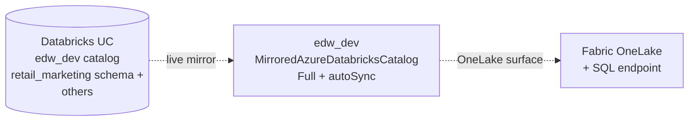

# 🪞 Mirrored Azure Databricks Catalog `edw_dev`

[← Orchestration](README.md) · [← Root](../../README.md)

## Configuration

| Field | Value |
|---|---|
| Item ID | `1e284ab4-dc84-4421-a96d-fe4f942cec97` |
| Type | MirroredAzureDatabricksCatalog |
| Source connection | `1d4b92c8-...` (Databricks workspace) |
| Source catalog | `edw_dev` |
| Mode | **Full** (all schemas mirrored) |
| autoSync | **Enabled** |
| Last sync | 2026-05-08 05:57:00Z **Success** |

## 🌐 What it does

Live read-only mirror of an Azure Databricks Unity Catalog catalog into Fabric OneLake. Tables in `edw_dev` UC become queryable from Fabric with **zero data movement** — they're surfaced via OneLake.

## 🔍 Consumers

**No pipeline references this mirror as source/sink** — pipelines don't need to. Consumers access mirrored data via:
- OneLake path (`abfss://...edw_dev/...`) from Spark/notebooks
- SQL endpoint (same host as Fabric DWs)

Notebook `nb-sync-uc-fabric-onelake` syncs `edw_dev.retail_marketing` UC → `Marketing_Lakehouse` in workspace `sg_DHalama`.

---
