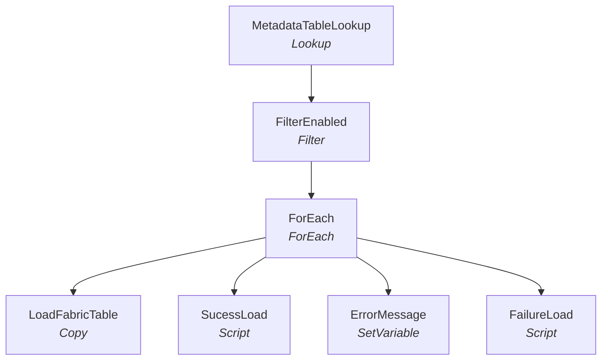

# 🔁 EDW2FabricLoader

_Item ID `28d162b6-5baa-4d35-9a7c-6c605bb6a826`_

[← Pipelines](README.md) · [← Orchestration](../README.md) · [← Root](../../../README.md)

## Summary

Metadata-driven copy from Azure SQL DB ASHLEY_EDW_DEV.dw_developer.FabricMapping → Fabric DW (artifactId f14e2ea6-ae2c-4b90-8e08-522e84f1aefc = Source_Data warehouse). Filters by Flag=1, executes per-row Query, updates status back.

## Activities tree

## Activity-by-activity

| Activity | Type | Detail |
|---|---|---|
| MetadataTableLookup | Lookup | Source type: `AzureSqlSource` Query (truncated): `SELECT EDWTableName, EDWSchemaName, FabricSchemaName, FabricDataBaseName, Query, Flag, LastloadStatus, LastLaodDate FROM [dw_developer].[FabricMapping]` |
| FilterEnabled | Filter | Filter expr: `@equals(item().Flag,1)` |
| ForEach | ForEach | Items: `@activity('FilterEnabled').output.value` · Sequential: False · BatchCount: — |
| &nbsp;&nbsp;LoadFabricTable | Copy | Source: `None` Sink: `None` |
| &nbsp;&nbsp;SucessLoad | Script | — |
| &nbsp;&nbsp;ErrorMessage | SetVariable | Variable `?` = `` |
| &nbsp;&nbsp;FailureLoad | Script | — |

## Variables

| Name | Type |
|---|---|
| `ErrorMessage` | String |

## Raw definition

Full JSON: [`data/pipelines/EDW2FabricLoader.json`](../../../data/pipelines/EDW2FabricLoader.json)

---
