# 🔀 05 — Data Flow (End-to-End Lineage)

[← Root](../../README.md)

## The big picture



```mermaid
flowchart LR
    classDef src fill:#e8f4fd,stroke:#3a8;
    classDef ing fill:#fef3c7,stroke:#d97706;
    classDef bronze fill:#dbeafe,stroke:#2563eb;
    classDef silver fill:#e0e7ff,stroke:#4f46e5;
    classDef gold fill:#fce7f3,stroke:#db2777;
    classDef ext fill:#fed,stroke:#c93;

    %% External sources
    EDW[(ASHLEY_EDW_DEV)]:::src
    SYN[(Synapse Ashley_Edw)]:::src
    DBX[(Databricks UC<br/>edw_dev)]:::src
    SAAS[UKG / AFI / Maximo /<br/>AshleyServiceNow / GA]:::src
    ADLS[ADLS Gen2<br/>ashleydevlake]:::ext
    PROD[(PROD WS<br/>ce4e6503)]:::ext

    %% Ingestion
    PIPE_EDW[EDW2FabricLoader]:::ing
    PIPE_MIG[Fabric Migration ADF]:::ing
    PIPE_RET[Load Retail_DW]:::ing
    PIPE_MD[Load MasterData_AFI]:::ing
    PIPE_BACK[Retail_Prod_To_Dev_DataBackFill]:::ing
    ADF[Mounted ADF<br/>ashleyv2datafactory]:::ing
    NB_VERS5[Vers5 notebooks]:::ing
    MIRROR[edw_dev Mirror]:::ing

    %% Bronze
    SD[Source_Data WH<br/>BRONZE<br/>64 schemas / 636 tables]:::bronze

    %% Silver
    RW[Retail_Warehouse<br/>198 tables · 146 procs]:::silver
    WW[Wholesale_Warehouse<br/>209 tables · 114 _Wrk views]:::silver
    MD[MasterData_Warehouse<br/>46 tables]:::silver
    DW[Distribution_Warehouse<br/>7 tables]:::silver

    %% Gold
    CW[Centralized_Warehouse<br/>38 tables · 0 procs]:::gold
    CL[(Centralized_Lakehouse<br/>501 tables · 5.92B rows<br/>shortcut to PROD)]:::gold

    %% Wiring
    EDW --> PIPE_EDW
    EDW --> PIPE_RET
    EDW -.> PIPE_BACK
    SYN --> PIPE_MIG
    SYN --> PIPE_MD
    SAAS --> ADF
    DBX --> MIRROR
    ADLS -.shortcuts.-> SD

    PIPE_EDW --> SD
    PIPE_MIG --> SD
    PIPE_MD --> SD
    PIPE_BACK --> SD
    ADF --> SD
    PIPE_RET --> RW
    NB_VERS5 --> CL
    MIRROR -.OneLake.-> CL
    PROD -.18 OneLake shortcuts.-> CL

    SD -- usp_RefreshCuratedTableFromView --> RW
    SD -- usp_RefreshCuratedTableFromView --> WW
    SD -- usp_RefreshCuratedTableFromView --> MD
    SD -- usp_RefreshCuratedTableFromView --> DW

    RW --> CW
    WW --> CW
    MD --> CW
    DW --> CW

    CW --> PBI[Power BI / Reporting]
    CL --> PBI
```

## Following one row from upstream to consumption

1. **Source** — row originates in:
   - On-prem SQL Server `ASHLEY_EDW_DEV` (e.g. `Retail_DW.DimItemMaster`)
   - Synapse SQLDW `Ashley_Edw`
   - SaaS feed via UKG / AFI / Maximo / AshleyServiceNow → Mounted ADF
   - Databricks Unity Catalog `edw_dev` → Mirror (Full + autoSync)

2. **Ingestion** — by one of:
   - Fabric Pipeline (driven by `ETL_Framework.TableDictionary` or `…FabricMapping`)
   - Mounted ADF (legacy ingestion path)
   - Notebook calling `Usp_CreateTableFromParquet*` (parquet on ADLS → Delta)
   - Mirror (no pipeline; data lives in OneLake automatically)

3. **Lands in `Source_Data`** — Bronze tier WH (64 schemas / 636 tables). Some tables also written to `Centralized_Lakehouse` via Vers5 notebook family.

4. **Promoted to domain warehouse** — via `usp_RefreshCuratedTableFromView` → `Retail_Warehouse`, `Wholesale_Warehouse`, `MasterData_Warehouse`, `Distribution_Warehouse`.

5. **Aggregated into `Centralized_Warehouse`** — 38 tables / 0 procs — loaded by external orchestrators / notebooks (e.g. `MetaData-Pull`).

6. **Consumed** — by Power BI semantic models (1 in this WS, others elsewhere) and SQLDatabase `Commissions_Prototype` (via misnamed `test` and `pipeline1` pipelines).

7. **Audit trail** — in `ETL_Framework.DW_Developer.AuditLog`. SLA breaches & data-feed failures land in `Performance_Logs.EmailQueue` and emailed via Office365 Logic App.

## Per-leg pages
## 🔬 Detail pages
- [🔍 Per-table lineage (50)](tables/README.md) — top tables with writers/readers/Mermaid
- [🕸️ Dependency graphs](dependency-graphs.md) — proc call graph + pipeline→proc edges


- [Source → Bronze](source-to-bronze.md) — how raw data lands in `Source_Data`
- [Bronze → Silver](bronze-to-silver.md) — how `usp_RefreshCuratedTableFromView` populates domain WHs
- [Silver → Gold](silver-to-gold.md) — how `Centralized_Warehouse` and `Centralized_Lakehouse` are populated

---
