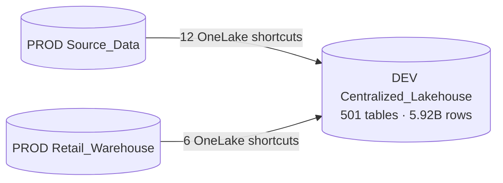

# Silver → Gold (Centralized)

[← Data Flow](README.md) · [← Root](../../README.md)

## Two parallel gold layers

### Centralized_Warehouse — 38 tables, 0 procs

Has no internal stored procs. Loaded externally by `MetaData-Pull` notebook which:
- Reads `Centralized_Warehouse.MetaData.CopyTables` config
- JDBC-copies all warehouses into `Centralized_Warehouse.{src_wh}_{schema}.{table}`

### Centralized_Lakehouse — 501 tables, 5.92 B rows

**SHORTCUT-BACKED.** 18 OneLake shortcuts:
- 12 → PROD `Source_Data` WH (`d27b3ef9-...`)
- 6 → PROD `Retail_Warehouse` WH (`d8bec39c-...`)

Twin schemas `Retail_Corporate` ↔ `Retail_Corporate_Prod` = 2 shortcuts to the same PROD path.

**Implication:** writes to DEV `Centralized_Lakehouse` schemas backed by shortcuts will **affect PROD-shaped paths**. Read-only consumption is safe; transformations should target a separate output table.

---
