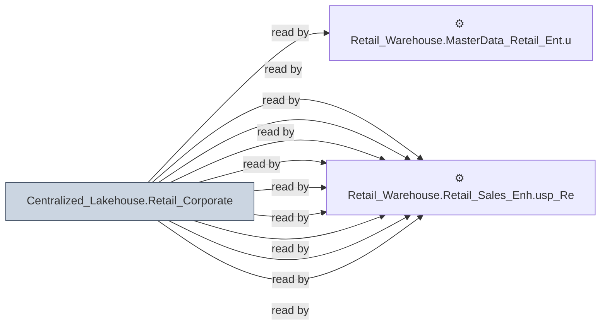

# 🔍 `Centralized_Lakehouse.Retail_Corporate`

[← Tables](README.md) · [← Data Flow](../README.md) · [← Root](../../../README.md)

## Lineage

## Writers (0)

_(no writers detected — possibly read-only or written by external process)_

## Readers (34)

- ⚙️ `Retail_Warehouse.MasterData_Retail_Ent.usp_Refresh_DataSetKey`
- ⚙️ `Retail_Warehouse.Retail_Sales_Enh.proc_GSCDemand_Allocate_Batched`
- ⚙️ `Retail_Warehouse.Retail_Sales_Enh.usp_GSCLocationProducts_Insert`
- ⚙️ `Retail_Warehouse.Retail_Sales_Enh.usp_GSCLocationProducts_UpdateAverageROS`
- ⚙️ `Retail_Warehouse.Retail_Sales_Enh.usp_GSCLocationProducts_UpdateValues`
- ⚙️ `Retail_Warehouse.Retail_Sales_Enh.usp_GSCSupply_Insert`
- ⚙️ `Retail_Warehouse.Retail_Sales_Enh.usp_Insert_GSCDemand`
- ⚙️ `Retail_Warehouse.Retail_Sales_Enh.usp_Refresh_BucketGetInventory`
- ⚙️ `Retail_Warehouse.Retail_Sales_Enh.usp_Refresh_BucketOrderItem`
- ⚙️ `Retail_Warehouse.Retail_Sales_Enh.usp_Refresh_BucketPOI`
- ⚙️ `Retail_Warehouse.Retail_Sales_Enh.usp_Refresh_Buckets_Update`
- ⚙️ `Retail_Warehouse.Retail_Sales_Enh.usp_Refresh_Buckets_Update_Test`
- ⚙️ `Retail_Warehouse.Retail_Sales_Enh.usp_Refresh_SmartPartials`
- ⚙️ `Retail_Warehouse.Retail_Sales_Enh.usp_SalesOrderHistQueue`
- ⚙️ `Retail_Warehouse.Retail_Sales_Enh.usp_Update_BucketInsert`
- ⚙️ `Retail_Warehouse.Retail_Sales_Enh.usp_Update_BucketInsert_OLD`
- ⚙️ `Retail_Warehouse.Retail_Sales_Enh.usp_Update_BucketInsert_Test`
- ⚙️ `Retail_Warehouse.Retail_Sales_Enh.usp_Update_GSCDemand`
- ⚙️ `Retail_Warehouse.Retail_Sales_Enh.usp_Update_SalesOrderHeader`
- ⚙️ `Retail_Warehouse.Retail_Sales_Enh.usp_Update_SalesOrderLine`
- ⚙️ `Retail_Warehouse.Retail_Sales_Enh.usp_Update_SalesOrderLineHistoryTest`
- ⚙️ `Retail_Warehouse.Retail_Sales_Wrk.usp_OrderHist_Payments`
- ⚙️ `Retail_Warehouse.Retail_Sales_Wrk.usp_OrderSplit`
- ⚙️ `Retail_Warehouse.Retail_Sales_Wrk.usp_OrderSplit_OI`
- ⚙️ `Retail_Warehouse.Retail_Sales_Wrk.usp_Refresh_SalesOrderSPChanges`
- 👁️ `Retail_Warehouse.Retail_Sales_Wrk.v_BucketInventory`
- 👁️ `Retail_Warehouse.Retail_Sales_Wrk.v_BucketOrderItem`
- 👁️ `Retail_Warehouse.Retail_Sales_Wrk.v_BucketPOI`
- 👁️ `Retail_Warehouse.Retail_Sales_Wrk.v_SalesAssociateCommission`
- 👁️ `Retail_Warehouse.Retail_Sales_Wrk.v_SalesOrderFulfillment`
- _… +4 more_

---
