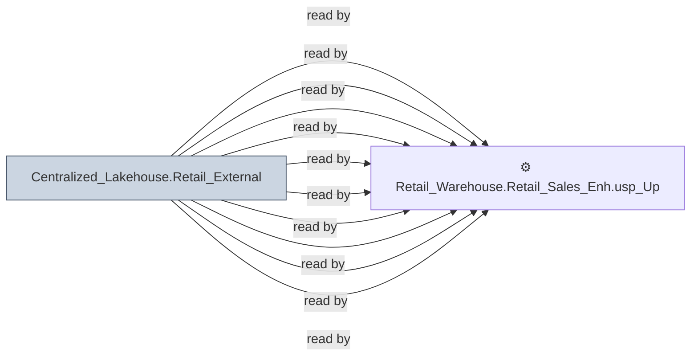

# 🔍 `Centralized_Lakehouse.Retail_External`

[← Tables](README.md) · [← Data Flow](../README.md) · [← Root](../../../README.md)

## Lineage

## Writers (0)

_(no writers detected — possibly read-only or written by external process)_

## Readers (13)

- ⚙️ `Retail_Warehouse.Retail_Sales_Enh.usp_GSCLocationProducts_Insert`
- ⚙️ `Retail_Warehouse.Retail_Sales_Enh.usp_Insert_GSCDemand`
- ⚙️ `Retail_Warehouse.Retail_Sales_Enh.usp_Refresh_Buckets_Update`
- ⚙️ `Retail_Warehouse.Retail_Sales_Enh.usp_Refresh_Buckets_Update_Test`
- ⚙️ `Retail_Warehouse.Retail_Sales_Enh.usp_Refresh_SmartPartials`
- ⚙️ `Retail_Warehouse.Retail_Sales_Enh.usp_SalesOrderHistQueue`
- ⚙️ `Retail_Warehouse.Retail_Sales_Enh.usp_Update_BucketInsert`
- ⚙️ `Retail_Warehouse.Retail_Sales_Enh.usp_Update_BucketInsert_OLD`
- ⚙️ `Retail_Warehouse.Retail_Sales_Enh.usp_Update_BucketInsert_Test`
- ⚙️ `Retail_Warehouse.Retail_Sales_Enh.usp_Update_GSCDemand`
- ⚙️ `Retail_Warehouse.Retail_Sales_Enh.usp_Update_SalesOrderHeader`
- ⚙️ `Retail_Warehouse.Retail_Sales_Enh.usp_Update_SalesOrderLine`
- ⚙️ `Retail_Warehouse.Retail_Sales_Wrk.usp_OrderHist_Payments`

---
