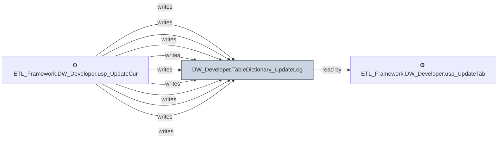

# 🔍 `DW_Developer.TableDictionary_UpdateLog`

[← Tables](README.md) · [← Data Flow](../README.md) · [← Root](../../../README.md)

## Lineage

## Writers (9)

- ⚙️ `ETL_Framework.DW_Developer.Usp_CreateTableFromParquet`
- ⚙️ `ETL_Framework.DW_Developer.Usp_CreateTableFromParquet_V1`
- ⚙️ `ETL_Framework.DW_Developer.usp_IncrementalTableLoad`
- ⚙️ `ETL_Framework.DW_Developer.usp_IncrementalTableLoad_Backup`
- ⚙️ `ETL_Framework.DW_Developer.usp_IncrementalTableLoad_CDC`
- ⚙️ `ETL_Framework.DW_Developer.usp_RefreshCuratedTableFromView`
- ⚙️ `ETL_Framework.DW_Developer.usp_RefreshCuratedTableFromView2`
- ⚙️ `ETL_Framework.DW_Developer.usp_SCD2_TableLoad`
- ⚙️ `ETL_Framework.DW_Developer.usp_UpdateCuratedTableFromView_DateRange`

## Readers (1)

- ⚙️ `ETL_Framework.DW_Developer.usp_UpdateTableDictionaryModified`

---
