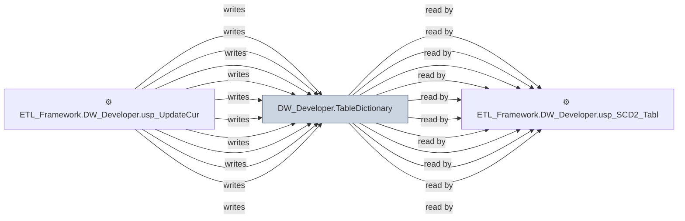

# 🔍 `DW_Developer.TableDictionary`

[← Tables](README.md) · [← Data Flow](../README.md) · [← Root](../../../README.md)

## Lineage

## Writers (11)

- ⚙️ `ETL_Framework.DW_Developer.Usp_CreateTableFromParquet`
- ⚙️ `ETL_Framework.DW_Developer.Usp_CreateTableFromParquet_1`
- ⚙️ `ETL_Framework.DW_Developer.Usp_CreateTableFromParquet_V1`
- ⚙️ `ETL_Framework.DW_Developer.usp_Audit_ADW_Tables`
- ⚙️ `ETL_Framework.DW_Developer.usp_Audit_ADW_Tables_V1`
- ⚙️ `ETL_Framework.DW_Developer.usp_Audit_Fabric_Tables`
- ⚙️ `ETL_Framework.DW_Developer.usp_IncrementalTableLoad`
- ⚙️ `ETL_Framework.DW_Developer.usp_IncrementalTableLoad_CDC`
- ⚙️ `ETL_Framework.DW_Developer.usp_RefreshCuratedTableFromView`
- ⚙️ `ETL_Framework.DW_Developer.usp_UpdateCuratedTableFromView_DateRange`
- ⚙️ `ETL_Framework.DW_Developer.usp_UpdateTableDictionary_ModifiedDate`

## Readers (14)

- ⚙️ `ETL_Framework.DW_Developer.Usp_CreateTableFromParquet`
- ⚙️ `ETL_Framework.DW_Developer.Usp_CreateTableFromParquet_1`
- ⚙️ `ETL_Framework.DW_Developer.Usp_CreateTableFromParquet_V1`
- ⚙️ `ETL_Framework.DW_Developer.usp_DataWarehouseDataFeedAlert_Fabric`
- ⚙️ `ETL_Framework.DW_Developer.usp_DataWarehouseSLAAlert_Fabric`
- ⚙️ `ETL_Framework.DW_Developer.usp_IncrementalTableLoad`
- ⚙️ `ETL_Framework.DW_Developer.usp_IncrementalTableLoad_Backup`
- ⚙️ `ETL_Framework.DW_Developer.usp_IncrementalTableLoad_CDC`
- ⚙️ `ETL_Framework.DW_Developer.usp_RefreshCuratedTableFromView`
- ⚙️ `ETL_Framework.DW_Developer.usp_SCD2_TableLoad`
- ⚙️ `ETL_Framework.DW_Developer.usp_UpdateCuratedTableFromView_DateRange`
- ⚙️ `ETL_Framework.DW_Developer.usp_UpdateTableDictionaryModified`
- ⚙️ `ETL_Framework.DW_Developer.usp_UpdateTableDictionary_ModifiedDate`
- 👁️ `ETL_Framework.DW_Developer.SchemaMappings`

---
