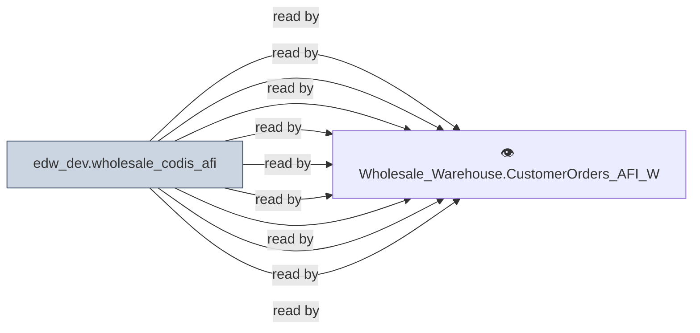

# 🔍 `edw_dev.wholesale_codis_afi`

[← Tables](README.md) · [← Data Flow](../README.md) · [← Root](../../../README.md)

## Lineage

## Writers (0)

_(no writers detected — possibly read-only or written by external process)_

## Readers (9)

- 👁️ `Wholesale_Warehouse.CustomerOrders_AFI_Wrk.v_ExtendedOrder`
- 👁️ `Wholesale_Warehouse.CustomerOrders_AFI_Wrk.v_OpenOrderAddress`
- 👁️ `Wholesale_Warehouse.CustomerOrders_AFI_Wrk.v_OpenOrderComments`
- 👁️ `Wholesale_Warehouse.CustomerOrders_AFI_Wrk.v_OpenOrderConsumerAddress`
- 👁️ `Wholesale_Warehouse.CustomerOrders_AFI_Wrk.v_OpenOrderDetail`
- 👁️ `Wholesale_Warehouse.CustomerOrders_AFI_Wrk.v_OpenOrderExtendedItem`
- 👁️ `Wholesale_Warehouse.CustomerOrders_AFI_Wrk.v_OpenOrderHeader`
- 👁️ `Wholesale_Warehouse.CustomerOrders_AFI_Wrk.v_OrderArrivalCode`
- 👁️ `Wholesale_Warehouse.CustomerOrders_AFI_Wrk.v_OrderArrivalGroup`

---
