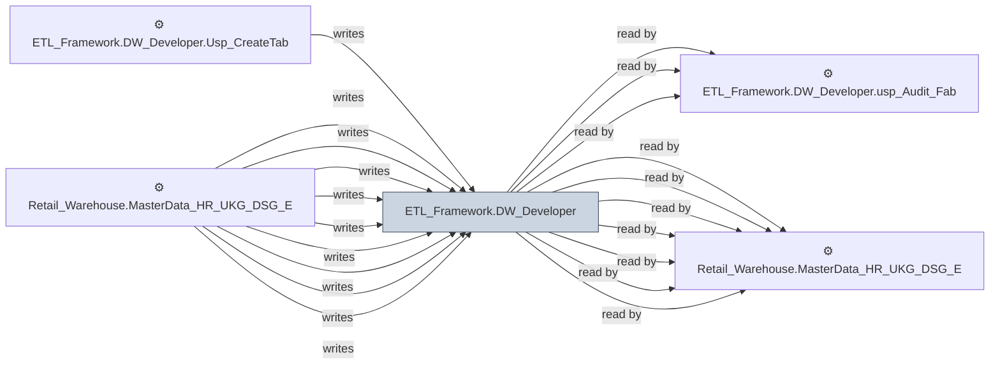

# 🔍 `ETL_Framework.DW_Developer`

[← Tables](README.md) · [← Data Flow](../README.md) · [← Root](../../../README.md)

## Lineage

## Writers (130)

- ⚙️ `ETL_Framework.DW_Developer.Usp_CreateTableFromParquet_1`
- ⚙️ `Retail_Warehouse.MasterData_HR_UKG_DSG_Enh.usp_Update_CompanyDetails`
- ⚙️ `Retail_Warehouse.MasterData_HR_UKG_DSG_Enh.usp_Update_EmploymentDetails`
- ⚙️ `Retail_Warehouse.MasterData_HR_UKG_DSG_Enh.usp_Update_HREmployeeHistory`
- ⚙️ `Retail_Warehouse.MasterData_HR_UKG_DSG_Enh.usp_Update_Jobs`
- ⚙️ `Retail_Warehouse.MasterData_HR_UKG_DSG_Enh.usp_Update_LaborCategory`
- ⚙️ `Retail_Warehouse.MasterData_HR_UKG_DSG_Enh.usp_Update_OrgLevel`
- ⚙️ `Retail_Warehouse.MasterData_HR_UKG_DSG_Enh.usp_Update_PayCodes`
- ⚙️ `Retail_Warehouse.MasterData_HR_UKG_DSG_Enh.usp_Update_PeopleRecords`
- ⚙️ `Retail_Warehouse.MasterData_HR_UKG_DSG_Enh.usp_Update_PersonDetails`
- ⚙️ `Retail_Warehouse.MasterData_HR_UKG_DSG_Enh.usp_Update_WorkRules`
- ⚙️ `Retail_Warehouse.MasterData_HR_UKG_Enh.usp_RefreshPayMatrix`
- ⚙️ `Retail_Warehouse.MasterData_HR_UKG_Enh.usp_RefreshTimeSheetSummaryPayMatrix`
- ⚙️ `Retail_Warehouse.MasterData_HR_UKG_Enh.usp_RefreshTimeSheetSummary_Benefits`
- ⚙️ `Retail_Warehouse.MasterData_HR_UKG_Enh.usp_RefreshTimeSheetSummary_ContractorData`
- ⚙️ `Retail_Warehouse.MasterData_HR_UKG_Enh.usp_RefreshTimeSheetSummary_TotalDCExpences`
- ⚙️ `Retail_Warehouse.MasterData_HR_UKG_Enh.usp_Refresh_DTRContractorData`
- ⚙️ `Retail_Warehouse.MasterData_HR_UKG_Enh.usp_Refresh_PayMatrix`
- ⚙️ `Retail_Warehouse.MasterData_HR_UKG_Enh.usp_Refresh_TimesheetETL`
- ⚙️ `Retail_Warehouse.MasterData_HR_UKG_Enh.usp_Update_CompanyDetails`
- ⚙️ `Retail_Warehouse.MasterData_HR_UKG_Enh.usp_Update_EmploymentDetails`
- ⚙️ `Retail_Warehouse.MasterData_HR_UKG_Enh.usp_Update_HREmployeeHistory`
- ⚙️ `Retail_Warehouse.MasterData_HR_UKG_Enh.usp_Update_Jobs`
- ⚙️ `Retail_Warehouse.MasterData_HR_UKG_Enh.usp_Update_LaborCategory`
- ⚙️ `Retail_Warehouse.MasterData_HR_UKG_Enh.usp_Update_OrgLevel`
- ⚙️ `Retail_Warehouse.MasterData_HR_UKG_Enh.usp_Update_PayCodes`
- ⚙️ `Retail_Warehouse.MasterData_HR_UKG_Enh.usp_Update_PeopleRecords`
- ⚙️ `Retail_Warehouse.MasterData_HR_UKG_Enh.usp_Update_PeopleTimeSheet`
- ⚙️ `Retail_Warehouse.MasterData_HR_UKG_Enh.usp_Update_PersonDetails`
- ⚙️ `Retail_Warehouse.MasterData_HR_UKG_Enh.usp_Update_TimeSheetHours`
- _… +100 more_

## Readers (132)

- ⚙️ `ETL_Framework.DW_Developer.usp_Audit_ADW_Tables`
- ⚙️ `ETL_Framework.DW_Developer.usp_Audit_ADW_Tables_V1`
- ⚙️ `ETL_Framework.DW_Developer.usp_Audit_Fabric_Tables`
- ⚙️ `Retail_Warehouse.MasterData_HR_UKG_DSG_Enh.usp_Update_CompanyDetails`
- ⚙️ `Retail_Warehouse.MasterData_HR_UKG_DSG_Enh.usp_Update_EmploymentDetails`
- ⚙️ `Retail_Warehouse.MasterData_HR_UKG_DSG_Enh.usp_Update_HREmployeeHistory`
- ⚙️ `Retail_Warehouse.MasterData_HR_UKG_DSG_Enh.usp_Update_Jobs`
- ⚙️ `Retail_Warehouse.MasterData_HR_UKG_DSG_Enh.usp_Update_LaborCategory`
- ⚙️ `Retail_Warehouse.MasterData_HR_UKG_DSG_Enh.usp_Update_OrgLevel`
- ⚙️ `Retail_Warehouse.MasterData_HR_UKG_DSG_Enh.usp_Update_PayCodes`
- ⚙️ `Retail_Warehouse.MasterData_HR_UKG_DSG_Enh.usp_Update_PeopleRecords`
- ⚙️ `Retail_Warehouse.MasterData_HR_UKG_DSG_Enh.usp_Update_PersonDetails`
- ⚙️ `Retail_Warehouse.MasterData_HR_UKG_DSG_Enh.usp_Update_WorkRules`
- ⚙️ `Retail_Warehouse.MasterData_HR_UKG_Enh.usp_RefreshPayMatrix`
- ⚙️ `Retail_Warehouse.MasterData_HR_UKG_Enh.usp_RefreshTimeSheetSummaryPayMatrix`
- ⚙️ `Retail_Warehouse.MasterData_HR_UKG_Enh.usp_RefreshTimeSheetSummary_Benefits`
- ⚙️ `Retail_Warehouse.MasterData_HR_UKG_Enh.usp_RefreshTimeSheetSummary_ContractorData`
- ⚙️ `Retail_Warehouse.MasterData_HR_UKG_Enh.usp_RefreshTimeSheetSummary_TotalDCExpences`
- ⚙️ `Retail_Warehouse.MasterData_HR_UKG_Enh.usp_Refresh_DTRContractorData`
- ⚙️ `Retail_Warehouse.MasterData_HR_UKG_Enh.usp_Refresh_PayMatrix`
- ⚙️ `Retail_Warehouse.MasterData_HR_UKG_Enh.usp_Refresh_TimesheetETL`
- ⚙️ `Retail_Warehouse.MasterData_HR_UKG_Enh.usp_Update_CompanyDetails`
- ⚙️ `Retail_Warehouse.MasterData_HR_UKG_Enh.usp_Update_EmploymentDetails`
- ⚙️ `Retail_Warehouse.MasterData_HR_UKG_Enh.usp_Update_HREmployeeHistory`
- ⚙️ `Retail_Warehouse.MasterData_HR_UKG_Enh.usp_Update_Jobs`
- ⚙️ `Retail_Warehouse.MasterData_HR_UKG_Enh.usp_Update_LaborCategory`
- ⚙️ `Retail_Warehouse.MasterData_HR_UKG_Enh.usp_Update_OrgLevel`
- ⚙️ `Retail_Warehouse.MasterData_HR_UKG_Enh.usp_Update_PayCodes`
- ⚙️ `Retail_Warehouse.MasterData_HR_UKG_Enh.usp_Update_PeopleRecords`
- ⚙️ `Retail_Warehouse.MasterData_HR_UKG_Enh.usp_Update_PeopleTimeSheet`
- _… +102 more_

---
