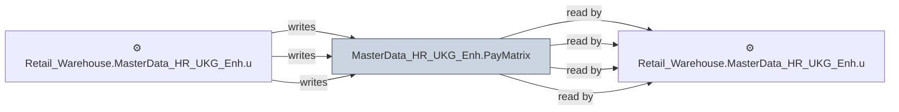

# 🔍 `MasterData_HR_UKG_Enh.PayMatrix`

[← Tables](README.md) · [← Data Flow](../README.md) · [← Root](../../../README.md)

## Lineage

## Writers (3)

- ⚙️ `Retail_Warehouse.MasterData_HR_UKG_Enh.usp_RefreshPayMatrix`
- ⚙️ `Retail_Warehouse.MasterData_HR_UKG_Enh.usp_RefreshTimeSheetSummaryPayMatrix`
- ⚙️ `Retail_Warehouse.MasterData_HR_UKG_Enh.usp_Refresh_PayMatrix`

## Readers (4)

- ⚙️ `Retail_Warehouse.MasterData_HR_UKG_Enh.usp_RefreshPayMatrix`
- ⚙️ `Retail_Warehouse.MasterData_HR_UKG_Enh.usp_RefreshTimeSheetSummaryPayMatrix`
- ⚙️ `Retail_Warehouse.MasterData_HR_UKG_Enh.usp_Refresh_PayMatrix`
- ⚙️ `Retail_Warehouse.MasterData_HR_UKG_Enh.usp_Update_TimeSheetSummary`

---
