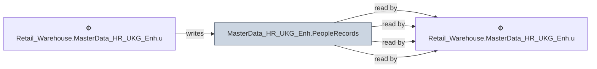

# 🔍 `MasterData_HR_UKG_Enh.PeopleRecords`

[← Tables](README.md) · [← Data Flow](../README.md) · [← Root](../../../README.md)

## Lineage

## Writers (1)

- ⚙️ `Retail_Warehouse.MasterData_HR_UKG_Enh.usp_Update_PeopleRecords`

## Readers (4)

- ⚙️ `Retail_Warehouse.MasterData_HR_UKG_Enh.usp_Update_HREmployeeHistory`
- ⚙️ `Retail_Warehouse.MasterData_HR_UKG_Enh.usp_Update_PeopleRecords`
- ⚙️ `Retail_Warehouse.MasterData_HR_UKG_Enh.usp_Update_PeopleTimeSheet`
- ⚙️ `Retail_Warehouse.MasterData_HR_UKG_Enh.usp_Update_TimeSheetHours`

---
