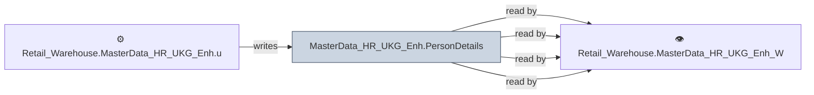

# 🔍 `MasterData_HR_UKG_Enh.PersonDetails`

[← Tables](README.md) · [← Data Flow](../README.md) · [← Root](../../../README.md)

## Lineage

## Writers (1)

- ⚙️ `Retail_Warehouse.MasterData_HR_UKG_Enh.usp_Update_PersonDetails`

## Readers (4)

- ⚙️ `Retail_Warehouse.MasterData_HR_UKG_Enh.usp_Update_EmploymentDetails`
- ⚙️ `Retail_Warehouse.MasterData_HR_UKG_Enh.usp_Update_PersonDetails`
- 👁️ `Retail_Warehouse.MasterData_HR_UKG_Enh_Wrk.v_EmployeeSupervisor`
- 👁️ `Retail_Warehouse.MasterData_HR_UKG_Enh_Wrk.v_Employees`

---
