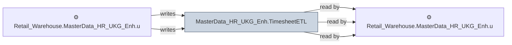

# 🔍 `MasterData_HR_UKG_Enh.TimesheetETL`

[← Tables](README.md) · [← Data Flow](../README.md) · [← Root](../../../README.md)

## Lineage

## Writers (2)

- ⚙️ `Retail_Warehouse.MasterData_HR_UKG_Enh.usp_Refresh_TimesheetETL`
- ⚙️ `Retail_Warehouse.MasterData_HR_UKG_Enh.usp_Update_TimesheetETL`

## Readers (3)

- ⚙️ `Retail_Warehouse.MasterData_HR_UKG_Enh.usp_Update_PeopleTimeSheet`
- ⚙️ `Retail_Warehouse.MasterData_HR_UKG_Enh.usp_Update_TimeSheetHours`
- ⚙️ `Retail_Warehouse.MasterData_HR_UKG_Enh.usp_Update_TimesheetETL`

---
