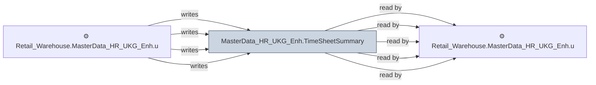

# 🔍 `MasterData_HR_UKG_Enh.TimeSheetSummary`

[← Tables](README.md) · [← Data Flow](../README.md) · [← Root](../../../README.md)

## Lineage

## Writers (4)

- ⚙️ `Retail_Warehouse.MasterData_HR_UKG_Enh.usp_RefreshTimeSheetSummaryPayMatrix`
- ⚙️ `Retail_Warehouse.MasterData_HR_UKG_Enh.usp_RefreshTimeSheetSummary_ContractorData`
- ⚙️ `Retail_Warehouse.MasterData_HR_UKG_Enh.usp_RefreshTimeSheetSummary_TotalDCExpences`
- ⚙️ `Retail_Warehouse.MasterData_HR_UKG_Enh.usp_Update_TimeSheetSummary`

## Readers (5)

- ⚙️ `Retail_Warehouse.MasterData_HR_UKG_Enh.usp_RefreshTimeSheetSummaryPayMatrix`
- ⚙️ `Retail_Warehouse.MasterData_HR_UKG_Enh.usp_RefreshTimeSheetSummary_Benefits`
- ⚙️ `Retail_Warehouse.MasterData_HR_UKG_Enh.usp_RefreshTimeSheetSummary_ContractorData`
- ⚙️ `Retail_Warehouse.MasterData_HR_UKG_Enh.usp_RefreshTimeSheetSummary_TotalDCExpences`
- ⚙️ `Retail_Warehouse.MasterData_HR_UKG_Enh.usp_Update_TimeSheetSummary`

---
