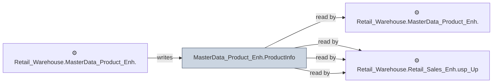

# 🔍 `MasterData_Product_Enh.ProductInfo`

[← Tables](README.md) · [← Data Flow](../README.md) · [← Root](../../../README.md)

## Lineage

## Writers (1)

- ⚙️ `Retail_Warehouse.MasterData_Product_Enh.usp_Refresh_ProductInfo`

## Readers (4)

- ⚙️ `Retail_Warehouse.MasterData_Product_Enh.usp_Refresh_ProductInfo`
- ⚙️ `Retail_Warehouse.Retail_OOM_Wrk.usp_PieceInventory_InvSubBucketID`
- ⚙️ `Retail_Warehouse.Retail_Sales_Enh.usp_Full_Refresh_SalesOrderHeader`
- ⚙️ `Retail_Warehouse.Retail_Sales_Enh.usp_Update_SalesOrderHeader`

---
