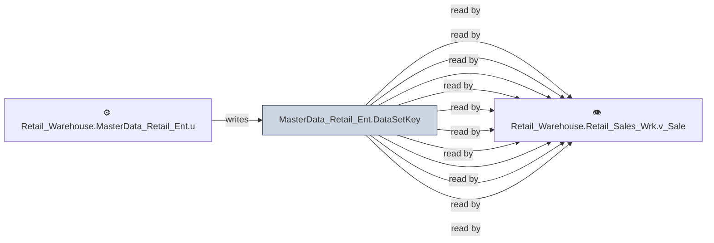

# 🔍 `MasterData_Retail_Ent.DataSetKey`

[← Tables](README.md) · [← Data Flow](../README.md) · [← Root](../../../README.md)

## Lineage

## Writers (1)

- ⚙️ `Retail_Warehouse.MasterData_Retail_Ent.usp_Refresh_DataSetKey`

## Readers (10)

- ⚙️ `Retail_Warehouse.Retail_Sales_Enh.usp_SalesOrderHistQueue`
- ⚙️ `Retail_Warehouse.Retail_Sales_Enh.usp_Update_SalesOrderHeader`
- ⚙️ `Retail_Warehouse.Retail_Sales_Wrk.usp_OrderHist_Payments`
- ⚙️ `Retail_Warehouse.Retail_Sales_Wrk.usp_OrderSplit`
- ⚙️ `Retail_Warehouse.Retail_Sales_Wrk.usp_OrderSplit_OI`
- 👁️ `Retail_Warehouse.Retail_Sales_Wrk.v_SalesAssociateCommission`
- 👁️ `Retail_Warehouse.Retail_Sales_Wrk.v_SalesOrderFulfillment`
- 👁️ `Retail_Warehouse.Retail_Sales_Wrk.v_SalesOrderHeader`
- 👁️ `Retail_Warehouse.Retail_Sales_Wrk.v_SalesOrderLine`
- 👁️ `Retail_Warehouse.Retail_Sales_Wrk.v_SalesOrderProductInfo`

---
