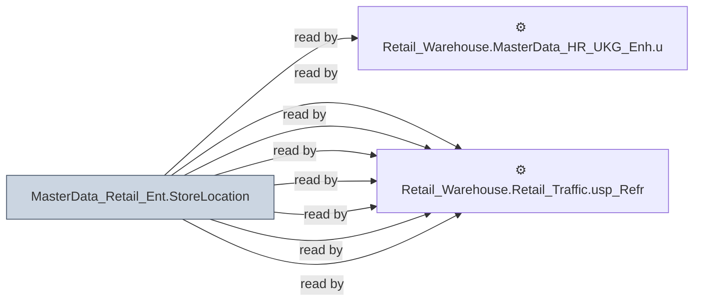

# 🔍 `MasterData_Retail_Ent.StoreLocation`

[← Tables](README.md) · [← Data Flow](../README.md) · [← Root](../../../README.md)

## Lineage

## Writers (0)

_(no writers detected — possibly read-only or written by external process)_

## Readers (8)

- ⚙️ `Retail_Warehouse.MasterData_HR_UKG_Enh.usp_Update_TimeSheetSummary`
- ⚙️ `Retail_Warehouse.Retail_Sales_Enh.usp_Full_Refresh_SalesOrderHeader`
- ⚙️ `Retail_Warehouse.Retail_Sales_Enh.usp_Update_SalesOrderHeader`
- ⚙️ `Retail_Warehouse.Retail_Sales_Enh.usp_Update_ScoreboardActivity`
- ⚙️ `Retail_Warehouse.Retail_Sales_Enh.usp_Update_ScoreboardActivity_20260223`
- ⚙️ `Retail_Warehouse.Retail_Sales_Enh.usp_Update_StoreTraffic`
- ⚙️ `Retail_Warehouse.Retail_Traffic.Usp_Refresh_RealTimeTraffic`
- ⚙️ `Retail_Warehouse.Retail_Traffic.usp_Refresh_EnterpriseActualTraffic`

---
