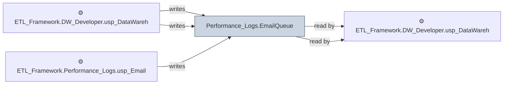

# 🔍 `Performance_Logs.EmailQueue`

[← Tables](README.md) · [← Data Flow](../README.md) · [← Root](../../../README.md)

## Lineage

## Writers (3)

- ⚙️ `ETL_Framework.DW_Developer.usp_DataWarehouseDataFeedAlert_Fabric`
- ⚙️ `ETL_Framework.DW_Developer.usp_DataWarehouseSLAAlert_Fabric`
- ⚙️ `ETL_Framework.Performance_Logs.usp_EmailQueue_MarkSent`

## Readers (2)

- ⚙️ `ETL_Framework.DW_Developer.usp_DataWarehouseDataFeedAlert_Fabric`
- ⚙️ `ETL_Framework.DW_Developer.usp_DataWarehouseSLAAlert_Fabric`

---
