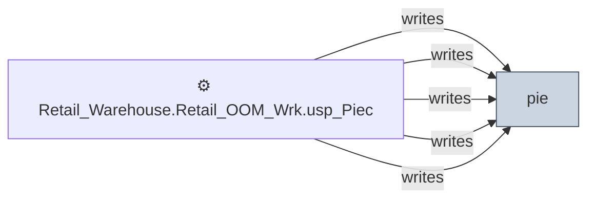

# 🔍 `pie`

[← Tables](README.md) · [← Data Flow](../README.md) · [← Root](../../../README.md)

## Lineage

## Writers (5)

- ⚙️ `Retail_Warehouse.Retail_OOM_Wrk.usp_PieceInventory_OISoftCommitted`
- ⚙️ `Retail_Warehouse.Retail_OOM_Wrk.usp_PieceInventory_SoftCommitted`
- ⚙️ `Retail_Warehouse.Retail_OOM_Wrk.usp_PieceInventory_SoftCommitted_MFR_CWC_ASAP`
- ⚙️ `Retail_Warehouse.Retail_OOM_Wrk.usp_PieceInventory_Update001`
- ⚙️ `Retail_Warehouse.Retail_OOM_Wrk.usp_PieceInventory_Update002`

## Readers (0)

_(no readers detected)_

---
