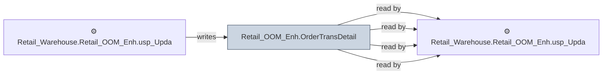

# 🔍 `Retail_OOM_Enh.OrderTransDetail`

[← Tables](README.md) · [← Data Flow](../README.md) · [← Root](../../../README.md)

## Lineage

## Writers (1)

- ⚙️ `Retail_Warehouse.Retail_OOM_Enh.usp_Update_OrderTransDetail`

## Readers (4)

- ⚙️ `Retail_Warehouse.Retail_OOM_Enh.usp_Update_OOMSchedulePerformance`
- ⚙️ `Retail_Warehouse.Retail_OOM_Enh.usp_Update_OOMSchedulePerformanceDetails`
- ⚙️ `Retail_Warehouse.Retail_OOM_Enh.usp_Update_OrderTransDetail`
- ⚙️ `Retail_Warehouse.Retail_OOM_Enh.usp_Update_OrderTransDetailDailyStat`

---
