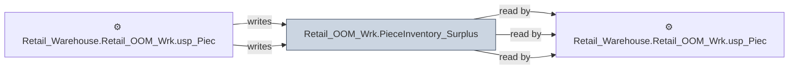

# 🔍 `Retail_OOM_Wrk.PieceInventory_Surplus`

[← Tables](README.md) · [← Data Flow](../README.md) · [← Root](../../../README.md)

## Lineage

## Writers (2)

- ⚙️ `Retail_Warehouse.Retail_OOM_Wrk.usp_PieceInventory_Surplus`
- ⚙️ `Retail_Warehouse.Retail_OOM_Wrk.usp_PieceInventory_Surplus_ROS`

## Readers (3)

- ⚙️ `Retail_Warehouse.Retail_OOM_Wrk.usp_InventoryDetail`
- ⚙️ `Retail_Warehouse.Retail_OOM_Wrk.usp_InventorySummary_Update`
- ⚙️ `Retail_Warehouse.Retail_OOM_Wrk.usp_PieceInventory_Surplus_ROS`

---
