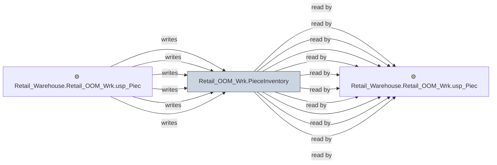

# 🔍 `Retail_OOM_Wrk.PieceInventory`

[← Tables](README.md) · [← Data Flow](../README.md) · [← Root](../../../README.md)

## Lineage

## Writers (6)

- ⚙️ `Retail_Warehouse.Retail_OOM_Wrk.usp_PieceInventory_Insert001`
- ⚙️ `Retail_Warehouse.Retail_OOM_Wrk.usp_PieceInventory_InternalTransfers`
- ⚙️ `Retail_Warehouse.Retail_OOM_Wrk.usp_PieceInventory_OrderStoreBrandID`
- ⚙️ `Retail_Warehouse.Retail_OOM_Wrk.usp_PieceInventory_Update001`
- ⚙️ `Retail_Warehouse.Retail_OOM_Wrk.usp_PieceInventory_Update002`
- ⚙️ `Retail_Warehouse.Retail_OOM_Wrk.usp_PieceInventory_UpdateOrderInfo`

## Readers (15)

- ⚙️ `Retail_Warehouse.Retail_OOM_Enh.usp_InventorySummary_Insert`
- ⚙️ `Retail_Warehouse.Retail_OOM_Enh.usp_PieceHist_Insert001`
- ⚙️ `Retail_Warehouse.Retail_OOM_Enh.usp_PieceInventoryToDART_InsertUpdate`
- ⚙️ `Retail_Warehouse.Retail_OOM_Wrk.usp_InventoryDetail`
- ⚙️ `Retail_Warehouse.Retail_OOM_Wrk.usp_InventorySummary_Update`
- ⚙️ `Retail_Warehouse.Retail_OOM_Wrk.usp_PieceInventory_InternalTransfers`
- ⚙️ `Retail_Warehouse.Retail_OOM_Wrk.usp_PieceInventory_InvSubBucketID`
- ⚙️ `Retail_Warehouse.Retail_OOM_Wrk.usp_PieceInventory_OISoftCommitted`
- ⚙️ `Retail_Warehouse.Retail_OOM_Wrk.usp_PieceInventory_OrderStoreBrandID`
- ⚙️ `Retail_Warehouse.Retail_OOM_Wrk.usp_PieceInventory_SoftCommitted`
- ⚙️ `Retail_Warehouse.Retail_OOM_Wrk.usp_PieceInventory_SoftCommitted_MFR_CWC_ASAP`
- ⚙️ `Retail_Warehouse.Retail_OOM_Wrk.usp_PieceInventory_Surplus`
- ⚙️ `Retail_Warehouse.Retail_OOM_Wrk.usp_PieceInventory_Update001`
- ⚙️ `Retail_Warehouse.Retail_OOM_Wrk.usp_PieceInventory_Update002`
- ⚙️ `Retail_Warehouse.Retail_OOM_Wrk.usp_PieceInventory_UpdateOrderInfo`

---
