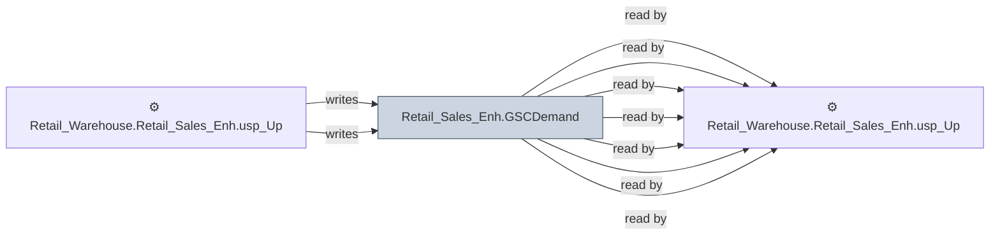

# 🔍 `Retail_Sales_Enh.GSCDemand`

[← Tables](README.md) · [← Data Flow](../README.md) · [← Root](../../../README.md)

## Lineage

## Writers (2)

- ⚙️ `Retail_Warehouse.Retail_Sales_Enh.usp_Insert_GSCDemand`
- ⚙️ `Retail_Warehouse.Retail_Sales_Enh.usp_Update_GSCDemand`

## Readers (7)

- ⚙️ `Retail_Warehouse.Retail_Sales_Enh.proc_GSCDemand_Allocate_Batched`
- ⚙️ `Retail_Warehouse.Retail_Sales_Enh.usp_GSCLocationProducts_UpdateValues`
- ⚙️ `Retail_Warehouse.Retail_Sales_Enh.usp_GSCSupply_Insert`
- ⚙️ `Retail_Warehouse.Retail_Sales_Enh.usp_Insert_GSCDemand`
- ⚙️ `Retail_Warehouse.Retail_Sales_Enh.usp_Refresh_SmartPartials`
- ⚙️ `Retail_Warehouse.Retail_Sales_Enh.usp_Update_GSCDemand`
- ⚙️ `Retail_Warehouse.Retail_Sales_Enh.usp_Update_GSCPeriodDataSet`

---
