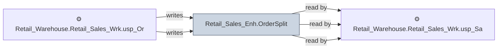

# 🔍 `Retail_Sales_Enh.OrderSplit`

[← Tables](README.md) · [← Data Flow](../README.md) · [← Root](../../../README.md)

## Lineage

## Writers (2)

- ⚙️ `Retail_Warehouse.Retail_Sales_Wrk.usp_OrderSplit_ProcessOrder`
- ⚙️ `Retail_Warehouse.Retail_Sales_Wrk.usp_OrderSplit_ProcessOrder_Bulk`

## Readers (3)

- ⚙️ `Retail_Warehouse.Retail_Sales_Wrk.usp_OrderSplit_ProcessOrder`
- ⚙️ `Retail_Warehouse.Retail_Sales_Wrk.usp_OrderSplit_ProcessOrder_Bulk`
- ⚙️ `Retail_Warehouse.Retail_Sales_Wrk.usp_SalesOrderHist_ProcessOrder_Bulk`

---
