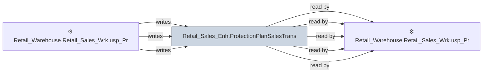

# 🔍 `Retail_Sales_Enh.ProtectionPlanSalesTrans`

[← Tables](README.md) · [← Data Flow](../README.md) · [← Root](../../../README.md)

## Lineage

## Writers (3)

- ⚙️ `Retail_Warehouse.Retail_Sales_Enh.usp_ProtectionPlanSalesTrans_Insert`
- ⚙️ `Retail_Warehouse.Retail_Sales_Wrk.usp_ProtectionPlanTrans_Bulk`
- ⚙️ `Retail_Warehouse.Retail_Sales_Wrk.usp_ProtectionPlanTrans_Delivered_Bulk`

## Readers (5)

- ⚙️ `Retail_Warehouse.Retail_Sales_Enh.usp_ProtectionPlanSalesTrans_Insert`
- ⚙️ `Retail_Warehouse.Retail_Sales_Enh.usp_ProtectionPlanTrans_Insert`
- ⚙️ `Retail_Warehouse.Retail_Sales_Wrk.usp_ProtectionPlanTrans`
- ⚙️ `Retail_Warehouse.Retail_Sales_Wrk.usp_ProtectionPlanTrans_Bulk`
- ⚙️ `Retail_Warehouse.Retail_Sales_Wrk.usp_ProtectionPlanTrans_Delivered_Bulk`

---
