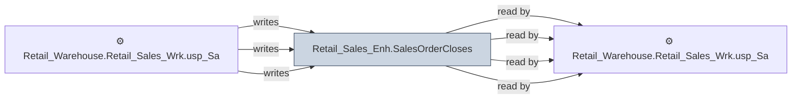

# 🔍 `Retail_Sales_Enh.SalesOrderCloses`

[← Tables](README.md) · [← Data Flow](../README.md) · [← Root](../../../README.md)

## Lineage

## Writers (3)

- ⚙️ `Retail_Warehouse.Retail_Sales_Enh.usp_SalesOrderCloses_ProcessSUOrder_Bulk`
- ⚙️ `Retail_Warehouse.Retail_Sales_Wrk.usp_SalesOrderCloses_ProcessSUOrder`
- ⚙️ `Retail_Warehouse.Retail_Sales_Wrk.usp_SalesOrderCloses_ProcessSUOrder_Bulk`

## Readers (4)

- ⚙️ `Retail_Warehouse.Retail_Sales_Enh.usp_SalesOrderCloses`
- ⚙️ `Retail_Warehouse.Retail_Sales_Enh.usp_SalesOrderCloses_ProcessSUOrder_Bulk`
- ⚙️ `Retail_Warehouse.Retail_Sales_Wrk.usp_SalesOrderCloses_ProcessSUOrder`
- ⚙️ `Retail_Warehouse.Retail_Sales_Wrk.usp_SalesOrderCloses_ProcessSUOrder_Bulk`

---
