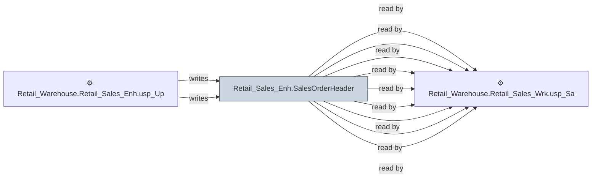

# 🔍 `Retail_Sales_Enh.SalesOrderHeader`

[← Tables](README.md) · [← Data Flow](../README.md) · [← Root](../../../README.md)

## Lineage

## Writers (2)

- ⚙️ `Retail_Warehouse.Retail_Sales_Enh.usp_Full_Refresh_SalesOrderHeader`
- ⚙️ `Retail_Warehouse.Retail_Sales_Enh.usp_Update_SalesOrderHeader`

## Readers (9)

- ⚙️ `Retail_Warehouse.Retail_Sales_Enh.usp_Full_Refresh_SalesOrderHeader`
- ⚙️ `Retail_Warehouse.Retail_Sales_Enh.usp_SalesOrderCloses`
- ⚙️ `Retail_Warehouse.Retail_Sales_Enh.usp_SalesOrderHistProcessOrders_Bulk`
- ⚙️ `Retail_Warehouse.Retail_Sales_Enh.usp_SalesOrderHistQueue`
- ⚙️ `Retail_Warehouse.Retail_Sales_Enh.usp_Update_SalesOrderHeader`
- ⚙️ `Retail_Warehouse.Retail_Sales_Enh.usp_Update_SalesOrderLineHistory`
- ⚙️ `Retail_Warehouse.Retail_Sales_Enh.usp_Update_SalesOrderLineHistoryTest`
- ⚙️ `Retail_Warehouse.Retail_Sales_Wrk.usp_OrderSplit_ProcessOrder_Bulk`
- ⚙️ `Retail_Warehouse.Retail_Sales_Wrk.usp_SalesOrderHist_Payments_Bulk`

---
