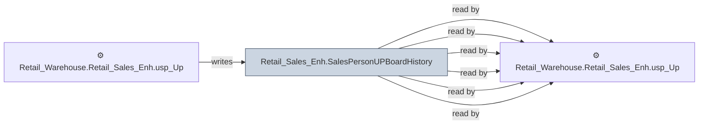

# 🔍 `Retail_Sales_Enh.SalesPersonUPBoardHistory`

[← Tables](README.md) · [← Data Flow](../README.md) · [← Root](../../../README.md)

## Lineage

## Writers (1)

- ⚙️ `Retail_Warehouse.Retail_Sales_Enh.usp_Update_SalespersonUPBoardHistory`

## Readers (6)

- ⚙️ `Retail_Warehouse.Retail_Sales_Enh.usp_Update_SalesPersonHourlyStats`
- ⚙️ `Retail_Warehouse.Retail_Sales_Enh.usp_Update_SalespersonUPBoardHistory`
- ⚙️ `Retail_Warehouse.Retail_Sales_Enh.usp_Update_ScoreboardActivity`
- ⚙️ `Retail_Warehouse.Retail_Sales_Enh.usp_Update_ScoreboardActivity_20260223`
- ⚙️ `Retail_Warehouse.Retail_Sales_Enh.usp_Update_ScoreboardManagerNotes`
- ⚙️ `Retail_Warehouse.Retail_Sales_Enh.usp_Update_ScoreboardManagerNotes_20260223`

---
