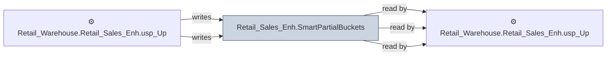

# 🔍 `Retail_Sales_Enh.SmartPartialBuckets`

[← Tables](README.md) · [← Data Flow](../README.md) · [← Root](../../../README.md)

## Lineage

## Writers (2)

- ⚙️ `Retail_Warehouse.Retail_Sales_Enh.usp_Update_BucketInsert`
- ⚙️ `Retail_Warehouse.Retail_Sales_Enh.usp_Update_BucketInsert_OLD`

## Readers (3)

- ⚙️ `Retail_Warehouse.Retail_Sales_Enh.usp_GSCLocationProducts_Insert`
- ⚙️ `Retail_Warehouse.Retail_Sales_Enh.usp_Update_BucketInsert`
- ⚙️ `Retail_Warehouse.Retail_Sales_Enh.usp_Update_BucketInsert_OLD`

---
