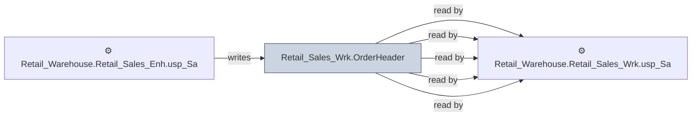

# 🔍 `Retail_Sales_Wrk.OrderHeader`

[← Tables](README.md) · [← Data Flow](../README.md) · [← Root](../../../README.md)

## Lineage

## Writers (1)

- ⚙️ `Retail_Warehouse.Retail_Sales_Enh.usp_SalesOrderHistProcessOrders_Bulk`

## Readers (5)

- ⚙️ `Retail_Warehouse.Retail_Sales_Enh.usp_SalesOrderHistProcessOrders_Bulk`
- ⚙️ `Retail_Warehouse.Retail_Sales_Wrk.usp_OrderSplit_ProcessOrder_Bulk`
- ⚙️ `Retail_Warehouse.Retail_Sales_Wrk.usp_SalesOrderHist_Insert_Bulk`
- ⚙️ `Retail_Warehouse.Retail_Sales_Wrk.usp_SalesOrderHist_Payments_Bulk`
- ⚙️ `Retail_Warehouse.Retail_Sales_Wrk.usp_SalesOrderHist_ProcessOrder_Bulk`

---
