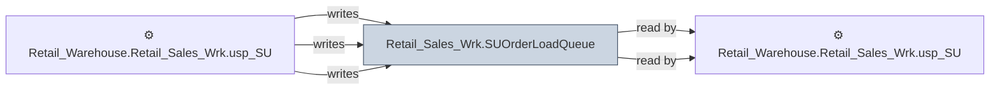

# 🔍 `Retail_Sales_Wrk.SUOrderLoadQueue`

[← Tables](README.md) · [← Data Flow](../README.md) · [← Root](../../../README.md)

## Lineage

## Writers (3)

- ⚙️ `Retail_Warehouse.Retail_Sales_Enh.usp_SalesOrderCloses`
- ⚙️ `Retail_Warehouse.Retail_Sales_Enh.usp_SalesOrderCloses_ProcessSUOrders`
- ⚙️ `Retail_Warehouse.Retail_Sales_Wrk.usp_SUOrder_LoadQueue_GetOrderID`

## Readers (2)

- ⚙️ `Retail_Warehouse.Retail_Sales_Enh.usp_SalesOrderCloses_ProcessSUOrders`
- ⚙️ `Retail_Warehouse.Retail_Sales_Wrk.usp_SUOrder_LoadQueue_GetOrderID`

---
