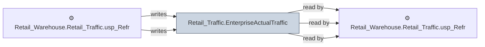

# 🔍 `Retail_Traffic.EnterpriseActualTraffic`

[← Tables](README.md) · [← Data Flow](../README.md) · [← Root](../../../README.md)

## Lineage

## Writers (2)

- ⚙️ `Retail_Warehouse.Retail_Traffic.usp_Load_EnterpriseActualTraffic_FromHistory`
- ⚙️ `Retail_Warehouse.Retail_Traffic.usp_Refresh_EnterpriseActualTraffic`

## Readers (3)

- ⚙️ `Retail_Warehouse.Retail_Traffic.Usp_Refresh_StoreTraffic`
- ⚙️ `Retail_Warehouse.Retail_Traffic.usp_Load_EnterpriseActualTraffic_FromHistory`
- ⚙️ `Retail_Warehouse.Retail_Traffic.usp_Refresh_EnterpriseActualTraffic`

---
