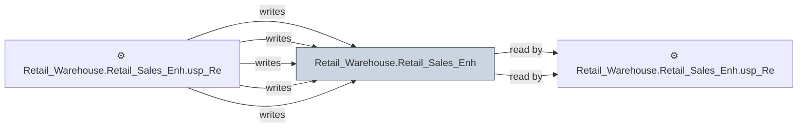

# 🔍 `Retail_Warehouse.Retail_Sales_Enh`

[← Tables](README.md) · [← Data Flow](../README.md) · [← Root](../../../README.md)

## Lineage

## Writers (5)

- ⚙️ `Retail_Warehouse.Retail_Sales_Enh.usp_Refresh_BucketGetInventory`
- ⚙️ `Retail_Warehouse.Retail_Sales_Enh.usp_Refresh_BucketOrderItem`
- ⚙️ `Retail_Warehouse.Retail_Sales_Enh.usp_Refresh_BucketPOI`
- ⚙️ `Retail_Warehouse.Retail_Sales_Enh.usp_Refresh_Buckets_Update`
- ⚙️ `Retail_Warehouse.Retail_Sales_Enh.usp_Refresh_Buckets_Update_Test`

## Readers (2)

- ⚙️ `Retail_Warehouse.Retail_Sales_Enh.usp_Refresh_Buckets_Update`
- ⚙️ `Retail_Warehouse.Retail_Sales_Enh.usp_Refresh_Buckets_Update_Test`

---
