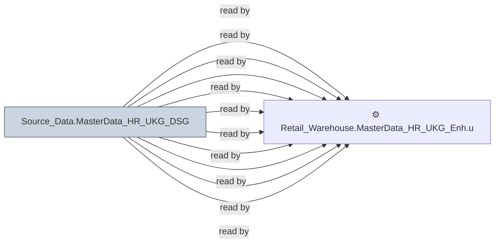

# 🔍 `Source_Data.MasterData_HR_UKG_DSG`

[← Tables](README.md) · [← Data Flow](../README.md) · [← Root](../../../README.md)

## Lineage

## Writers (0)

_(no writers detected — possibly read-only or written by external process)_

## Readers (12)

- ⚙️ `Retail_Warehouse.MasterData_HR_UKG_DSG_Enh.usp_Update_CompanyDetails`
- ⚙️ `Retail_Warehouse.MasterData_HR_UKG_DSG_Enh.usp_Update_EmploymentDetails`
- ⚙️ `Retail_Warehouse.MasterData_HR_UKG_DSG_Enh.usp_Update_Jobs`
- ⚙️ `Retail_Warehouse.MasterData_HR_UKG_DSG_Enh.usp_Update_LaborCategory`
- ⚙️ `Retail_Warehouse.MasterData_HR_UKG_DSG_Enh.usp_Update_OrgLevel`
- ⚙️ `Retail_Warehouse.MasterData_HR_UKG_DSG_Enh.usp_Update_PayCodes`
- ⚙️ `Retail_Warehouse.MasterData_HR_UKG_DSG_Enh.usp_Update_PersonDetails`
- ⚙️ `Retail_Warehouse.MasterData_HR_UKG_DSG_Enh.usp_Update_WorkRules`
- ⚙️ `Retail_Warehouse.MasterData_HR_UKG_Enh.usp_Update_EmploymentDetails`
- ⚙️ `Retail_Warehouse.MasterData_HR_UKG_Enh.usp_Update_WFMTimesheet`
- ⚙️ `Retail_Warehouse.MasterData_HR_UKG_Enh.usp_Update_WorkRules`
- 👁️ `Retail_Warehouse.MasterData_HR_UKG_DSG_Enh_Wrk.v_Employees`

---
