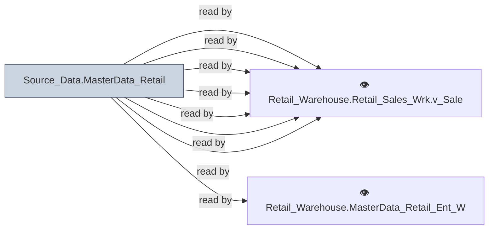

# 🔍 `Source_Data.MasterData_Retail`

[← Tables](README.md) · [← Data Flow](../README.md) · [← Root](../../../README.md)

## Lineage

## Writers (0)

_(no writers detected — possibly read-only or written by external process)_

## Readers (8)

- ⚙️ `Retail_Warehouse.Retail_OOM_Enh.usp_GLHist`
- ⚙️ `Retail_Warehouse.Retail_Sales.usp_Update_SalespersonUPBoardHistoryAGR`
- ⚙️ `Retail_Warehouse.Retail_Sales_Enh.usp_Update_SalesPersonHourlyStats`
- ⚙️ `Retail_Warehouse.Retail_Sales_Enh.usp_Update_SalespersonUPBoardHistory`
- 👁️ `Retail_Warehouse.MasterData_Retail_Ent_Wrk.v_StoreLocation`
- 👁️ `Retail_Warehouse.Retail_Sales_Wrk.v_CreditReview`
- 👁️ `Retail_Warehouse.Retail_Sales_Wrk.v_RegisteredGuest`
- 👁️ `Retail_Warehouse.Retail_Sales_Wrk.v_SalesOrderHeader`

---
