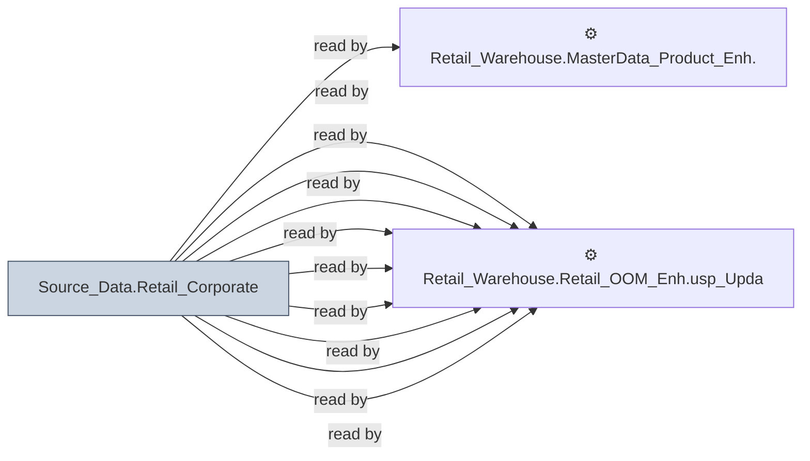

# 🔍 `Source_Data.Retail_Corporate`

[← Tables](README.md) · [← Data Flow](../README.md) · [← Root](../../../README.md)

## Lineage

## Writers (0)

_(no writers detected — possibly read-only or written by external process)_

## Readers (39)

- ⚙️ `Retail_Warehouse.MasterData_Product_Enh.usp_Refresh_ProductInfo`
- ⚙️ `Retail_Warehouse.Retail_OOM_Enh.usp_Buckets_Insert`
- ⚙️ `Retail_Warehouse.Retail_OOM_Enh.usp_InvActivitySummary`
- ⚙️ `Retail_Warehouse.Retail_OOM_Enh.usp_InvActivitySummary_Test`
- ⚙️ `Retail_Warehouse.Retail_OOM_Enh.usp_OpenOrderSummary_Insert`
- ⚙️ `Retail_Warehouse.Retail_OOM_Enh.usp_OpenOrderSummary_Insert_Detail`
- ⚙️ `Retail_Warehouse.Retail_OOM_Enh.usp_PieceHist_Insert001`
- ⚙️ `Retail_Warehouse.Retail_OOM_Enh.usp_Update_OOMSchedulePerformance`
- ⚙️ `Retail_Warehouse.Retail_OOM_Enh.usp_Update_OOMSchedulePerformanceDetails`
- ⚙️ `Retail_Warehouse.Retail_OOM_Enh.usp_Update_OrderChangeRegistry`
- ⚙️ `Retail_Warehouse.Retail_OOM_Enh.usp_Update_OrderTransDetail`
- ⚙️ `Retail_Warehouse.Retail_OOM_Enh.usp_Update_OrderTransDetailDailyStat`
- ⚙️ `Retail_Warehouse.Retail_OOM_Wrk.usp_InventoryDetail`
- ⚙️ `Retail_Warehouse.Retail_OOM_Wrk.usp_PieceInventory_Insert001`
- ⚙️ `Retail_Warehouse.Retail_OOM_Wrk.usp_PieceInventory_InternalTransfers`
- ⚙️ `Retail_Warehouse.Retail_OOM_Wrk.usp_PieceInventory_InvSubBucketID`
- ⚙️ `Retail_Warehouse.Retail_OOM_Wrk.usp_PieceInventory_OISoftCommitted`
- ⚙️ `Retail_Warehouse.Retail_OOM_Wrk.usp_PieceInventory_OrderStoreBrandID`
- ⚙️ `Retail_Warehouse.Retail_OOM_Wrk.usp_PieceInventory_SoftCommitted`
- ⚙️ `Retail_Warehouse.Retail_OOM_Wrk.usp_PieceInventory_SoftCommitted_MFR_CWC_ASAP`
- ⚙️ `Retail_Warehouse.Retail_OOM_Wrk.usp_PieceInventory_Surplus_ROS`
- ⚙️ `Retail_Warehouse.Retail_OOM_Wrk.usp_PieceInventory_Update001`
- ⚙️ `Retail_Warehouse.Retail_OOM_Wrk.usp_PieceInventory_Update002`
- ⚙️ `Retail_Warehouse.Retail_Sales_Enh.usp_Full_Refresh_SalesOrderHeader`
- ⚙️ `Retail_Warehouse.Retail_Sales_Enh.usp_ProtectionPlanTrans_Insert`
- ⚙️ `Retail_Warehouse.Retail_Sales_Enh.usp_Update_CreditReview`
- ⚙️ `Retail_Warehouse.Retail_Sales_Enh.usp_Update_SalesOrderLineHistory`
- ⚙️ `Retail_Warehouse.Retail_Sales_Enh.usp_Update_SalespersonUPBoardHistory`
- ⚙️ `Retail_Warehouse.Retail_Sales_Wrk.usp_ProtectionPlanTrans_Delivered_Bulk`
- 👁️ `Retail_Warehouse.MasterData_Ent_Wrk.v_CustomerInfo`
- _… +9 more_

---
