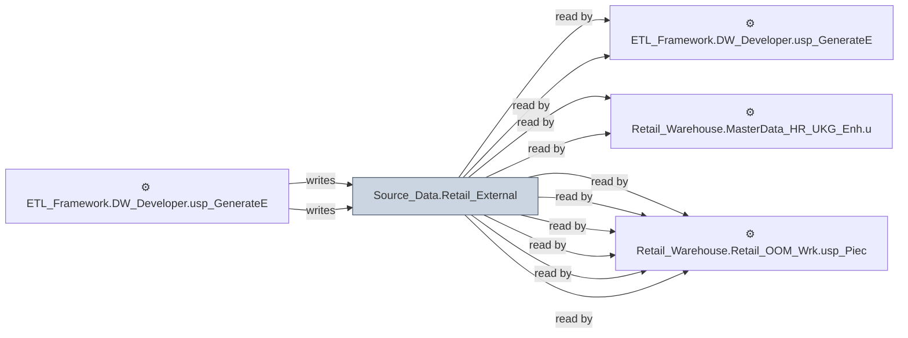

# 🔍 `Source_Data.Retail_External`

[← Tables](README.md) · [← Data Flow](../README.md) · [← Root](../../../README.md)

## Lineage

## Writers (2)

- ⚙️ `ETL_Framework.DW_Developer.usp_GenerateEmailHTML_DimAggregateDifference`
- ⚙️ `ETL_Framework.DW_Developer.usp_GenerateEmailHTML_DimCountDifference`

## Readers (26)

- ⚙️ `ETL_Framework.DW_Developer.usp_GenerateEmailHTML_DimAggregateDifference`
- ⚙️ `ETL_Framework.DW_Developer.usp_GenerateEmailHTML_DimCountDifference`
- ⚙️ `Retail_Warehouse.MasterData_HR_UKG_Enh.usp_Refresh_PayMatrix`
- ⚙️ `Retail_Warehouse.MasterData_HR_UKG_Enh.usp_Update_PeopleTimeSheet`
- ⚙️ `Retail_Warehouse.Retail_OOM_Enh.usp_Buckets_Insert`
- ⚙️ `Retail_Warehouse.Retail_OOM_Enh.usp_InvActivitySummary`
- ⚙️ `Retail_Warehouse.Retail_OOM_Enh.usp_InvActivitySummary_Test`
- ⚙️ `Retail_Warehouse.Retail_OOM_Enh.usp_PieceInventoryToDART_InsertUpdate`
- ⚙️ `Retail_Warehouse.Retail_OOM_Wrk.usp_InventorySummary_Update`
- ⚙️ `Retail_Warehouse.Retail_OOM_Wrk.usp_PieceInventory_OrderStoreBrandID`
- ⚙️ `Retail_Warehouse.Retail_OOM_Wrk.usp_PieceInventory_Surplus`
- ⚙️ `Retail_Warehouse.Retail_OOM_Wrk.usp_PieceInventory_Surplus_ROS`
- ⚙️ `Retail_Warehouse.Retail_OOM_Wrk.usp_PieceInventory_Update001`
- ⚙️ `Retail_Warehouse.Retail_Sales_Enh.usp_Full_Refresh_SalesOrderHeader`
- ⚙️ `Retail_Warehouse.Retail_Sales_Enh.usp_SalesOrderCloses`
- ⚙️ `Retail_Warehouse.Retail_Sales_Enh.usp_Update_CreditReview`
- ⚙️ `Retail_Warehouse.Retail_Sales_Enh.usp_Update_SalesOrderLineHistory`
- ⚙️ `Retail_Warehouse.Retail_Sales_Enh.usp_Update_SalesOrderLineHistoryTest`
- ⚙️ `Retail_Warehouse.Retail_Sales_Enh.usp_Update_SalespersonUPBoardHistory`
- ⚙️ `Retail_Warehouse.Retail_Sales_Enh.usp_Update_StoreTraffic`
- ⚙️ `Retail_Warehouse.Retail_Traffic.Usp_Refresh_StoreTraffic`
- 👁️ `Retail_Warehouse.MasterData_Ent_Wrk.v_PaymentType`
- 👁️ `Retail_Warehouse.MasterData_Ent_Wrk.v_ReasonCode`
- 👁️ `Retail_Warehouse.MasterData_Retail_Ent_Wrk.v_StoreLocation`
- 👁️ `Retail_Warehouse.MasterData_Retail_Ent_Wrk.v_StoreLocationCalendar`
- 👁️ `Retail_Warehouse.MasterData_Retail_Ent_Wrk.v_StoreLocationGroup`

---
