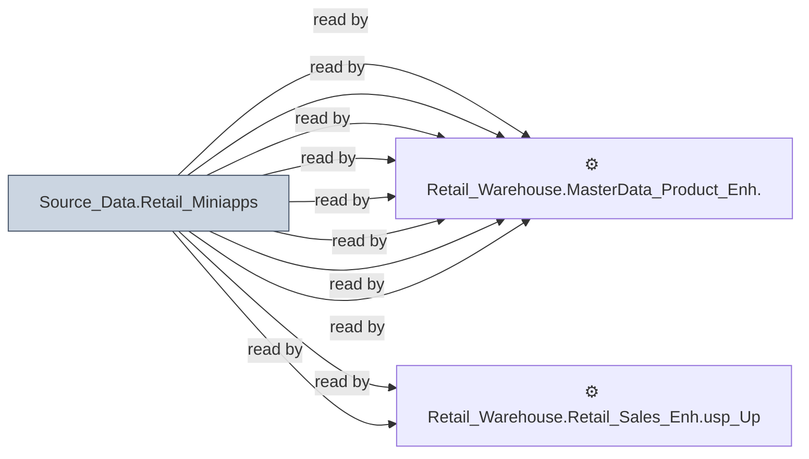

# 🔍 `Source_Data.Retail_Miniapps`

[← Tables](README.md) · [← Data Flow](../README.md) · [← Root](../../../README.md)

## Lineage

## Writers (0)

_(no writers detected — possibly read-only or written by external process)_

## Readers (18)

- ⚙️ `Retail_Warehouse.MasterData_HR_UKG_DSG_Enh.usp_Update_PeopleRecords`
- ⚙️ `Retail_Warehouse.MasterData_HR_UKG_Enh.usp_RefreshTimeSheetSummary_Benefits`
- ⚙️ `Retail_Warehouse.MasterData_HR_UKG_Enh.usp_RefreshTimeSheetSummary_ContractorData`
- ⚙️ `Retail_Warehouse.MasterData_HR_UKG_Enh.usp_RefreshTimeSheetSummary_TotalDCExpences`
- ⚙️ `Retail_Warehouse.MasterData_HR_UKG_Enh.usp_Refresh_DTRContractorData`
- ⚙️ `Retail_Warehouse.MasterData_HR_UKG_Enh.usp_Update_PeopleRecords`
- ⚙️ `Retail_Warehouse.MasterData_HR_UKG_Enh.usp_Update_WFMTimesheet`
- ⚙️ `Retail_Warehouse.MasterData_Product_Enh.usp_Refresh_ProductInfo`
- ⚙️ `Retail_Warehouse.Retail_OOM_Wrk.usp_InventorySummary_Update`
- ⚙️ `Retail_Warehouse.Retail_Sales_Enh.usp_Update_SalespersonUPBoardHistory`
- ⚙️ `Retail_Warehouse.Retail_Sales_Enh.usp_Update_StoreTraffic`
- ⚙️ `Retail_Warehouse.Retail_Traffic.Usp_Refresh_OverrideTraffic`
- ⚙️ `Retail_Warehouse.Retail_Traffic.Usp_Refresh_RealTimeTraffic`
- ⚙️ `Retail_Warehouse.Retail_Traffic.Usp_Refresh_StoreTraffic`
- 👁️ `Retail_Warehouse.MasterData_HR_UKG_Enh_Wrk.v_Employees`
- 👁️ `Retail_Warehouse.MasterData_Product_Wrk.v_ProductInfo`
- 👁️ `Retail_Warehouse.MasterData_Product_Wrk.v_ProductSeries`
- 👁️ `Retail_Warehouse.MasterData_Retail_Ent_Wrk.v_SalesPerson`

---
