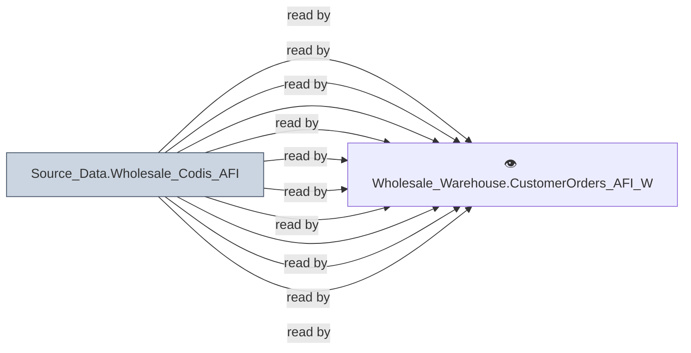

# 🔍 `Source_Data.Wholesale_Codis_AFI`

[← Tables](README.md) · [← Data Flow](../README.md) · [← Root](../../../README.md)

## Lineage

## Writers (0)

_(no writers detected — possibly read-only or written by external process)_

## Readers (16)

- 👁️ `Wholesale_Warehouse.CustomerOrders_AFI_Wrk.v_CreditCodes`
- 👁️ `Wholesale_Warehouse.CustomerOrders_AFI_Wrk.v_DashboardValueList`
- 👁️ `Wholesale_Warehouse.CustomerOrders_AFI_Wrk.v_OrderCancellationReasonCode`
- 👁️ `Wholesale_Warehouse.CustomerOrders_AFI_Wrk.v_OrderSchedule`
- 👁️ `Wholesale_Warehouse.CustomerOrders_AFI_Wrk.v_OrderTypeCode`
- 👁️ `Wholesale_Warehouse.CustomerOrders_AFI_Wrk.v_RequestDateChangeCode`
- 👁️ `Wholesale_Warehouse.CustomerOrders_AFI_Wrk.v_RouteTimeFenceControl`
- 👁️ `Wholesale_Warehouse.CustomerOrders_AFI_Wrk.v_RouteZoneControl`
- 👁️ `Wholesale_Warehouse.CustomerOrders_AFI_Wrk.v_SchedulerControl`
- 👁️ `Wholesale_Warehouse.CustomerOrders_AFI_Wrk.v_TermsCode`
- 👁️ `Wholesale_Warehouse.CustomerOrders_AFI_Wrk.v_WarehouseFillRequest`
- 👁️ `Wholesale_Warehouse.CustomerOrders_AFI_Wrk.v_WarehouseMaster`
- 👁️ `Wholesale_Warehouse.Customers_Wrk.v_CustomerCredit`
- 👁️ `Wholesale_Warehouse.SalesHistory_AFI_Wrk.v_InvoiceDetail`
- 👁️ `Wholesale_Warehouse.SalesHistory_AFI_Wrk.v_InvoiceHeader`
- 👁️ `Wholesale_Warehouse.SalesHistory_AFI_Wrk.v_OpenInvoices`

---
